# MediaViewer

**Open a camera dump the moment you double-click it. Pan a 42-megapixel RAW without dropping a frame.**

MediaViewer is a fast, keyboard-first viewer for the folder that comes off your camera: photos, RAW and
video side by side in one window. It draws on its own Direct3D 11 surface instead of a stock image or
media-player control, so decoding never stands between you and the screen.

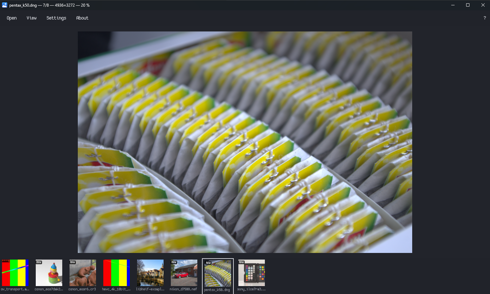

## Download

**[MediaViewer 0.1.2](https://github.com/longtimeno-c/mediaviewer/releases/tag/v0.1.2)** is the current public release.

**Status: PR 7's slices are all merged and pass locally. Its clean-VM HEIC, real
Live Photo and on-screen no-pop checks now have gates around them
([Where this actually is](#where-this-actually-is)); what remains of those three
is a clean VM, a phone and one look at a RAW opening. PR 8 — packaging — is in progress:
the icon, About, the Inno wizard, the Velopack updater, opt-in telemetry and the bundled
runtimes are in the tree and build, the wizard installs and uninstalls cleanly on this
machine, and the signature-rejection suite passes. It has **not** been through the
clean-VM run its verify line asks for, and no artefact is signed — see
[Package and install](#package-and-install-pr-8). PRs 9–15 are next, on both platforms at once.
The owner widened the 2026-09-13 sequencing exception on 2026-09-17
([plan/12-decision-log.md](plan/12-decision-log.md)) so Mac work (the Mac halves of PRs 1–8) no longer waits
on Windows PR 8 shipping; Mac PR 1 (Metal present lab), Mac PR 2 (decode + pan/zoom, folded in the
PR 7 formats/Crashpad scope) and Mac PR 3 (SwiftUI chrome, folded in the PR 4/PR 6
folder/filmstrip-backend/keyboard scope) are all in the tree. The Darwin target configures,
builds and links with a real toolchain (`cmake`+`ninja`+`vcpkg`+`swift build`) and its Catch2
suite passes (210 assertions, 60 cases). It has been run on a real Mac with a display
(2026-09-19): the 60 s present-loop gate passes with the chrome on screen, and the window,
menu bar, filmstrip, gallery and `?` sheet were driven by hand. Still unproven on Mac:
drag-and-drop, copy/move/Trash and slideshow on real folders, a *by-eye* check of animated
GIF/APNG/WebP playback (the render loop is traced cycling a 4-frame GIF at its 500 ms delays,
looping forever, but a screen capture of the Metal layer is not a reliable instrument, so
nobody has yet watched it), and the tonal step when a RAW's embedded preview is replaced
by the full decode — see [macOS](#macos-mac-prs-16) below. Mac PR 8 (MediaViewer.app: Finder open,
Quick Look thumbnails, Sparkle updates, the notarized disk image) is written but **not yet
built or run on a Mac** — see [MediaViewer.app](#mediaviewerapp-and-a-shippable-mac-build-mac-pr-8).**
The Windows present lab still owns
the Win32 window and D3D11 swapchain. WinUI 3 chrome is XAML islands on that
window: command bar (top) and filmstrip (bottom). Open a folder of JPEG/PNG/BMP/GIF/WebP,
TIFF/ICO/HEIC/AVIF/camera RAW **or video**; the strip virtualizes, thumbs come from a SQLite + JPEG-512 disk
cache, arrow keys move the selection. PR 5 puts video on that same swapchain —
FFmpeg demux and decode, D3D11VA on the lab's own device, NV12/P010 sampled and
tone-mapped in one shader, a WASAPI audio master clock, and a transport (seek,
frame step, speed, A-B loop, resume, media keys). Photos and clips are one
folder and one present path. PR 6 makes browse keyboard-complete: one key
router over a live command table, `?` shortcuts built from that table, a
Settings screen that remaps it, marks, copy/move-to, Recycle
Bin delete, fullscreen, slideshow as a mode, fit/fill/100 %, gallery drag-and-drop,
and animated GIF/APNG/WebP on the frame clock. PR 7 (in progress) adds the camera-dump
formats — TIFF and ICO (libtiff), HEIC/HEIF (libheif + libde265; the Windows HEIF codec
is used for plain HEIC stills only when the Store HEVC pack is present), AVIF still and
animated (libavif + dav1d), and camera RAW (LibRaw: the embedded preview is first pixel,
then the full decode) — plus RAW+JPEG and Live Photo pairing, and out-of-process
Crashpad crash reporting whose dumps are scrubbed of paths, filenames and the
username before anything could be sent (no upload endpoint exists yet), a
preview→full refinement that keeps the view and cross-fades instead of refitting,
and a tiled pyramid for images above 64 MP or wider than 16384 px. A broken-file
corpus (`mv_broken_tests`) runs in every CI build leg, and per-decoder libFuzzer
harnesses (`-DMV_FUZZ=ON` under clang-cl, `tools/fuzz/run.ps1`) run briefly on
pull requests and for longer nightly.

macOS is Milestone F ([plan/15-platforms.md](plan/15-platforms.md)), a later
host of the same core — not a UI-only port. Mac PR 1 is the Metal present lab
(AppKit + `CAMetalLayer` + `CAMetalDisplayLink`). Mac PR 2 adds JPEG/PNG/BMP decode,
immutable Metal texture upload, fit / wheel-zoom-toward-cursor / drag-pan, and an MSL
twin of the blit shader, plus (folded in from Windows PR 7) the rest of the D5 still
formats and RAW+JPEG/Live Photo pairing detection. Crashpad and the Mac minidump scrub,
planned there, never landed with it; they are in the Mac half of PR 11 (below).
Mac PR 3 hosts SwiftUI chrome in the same AppKit window (the canvas stays Metal, never
ported): a command bar, a bottom filmstrip, and a full-grid gallery overlay, all driven
by an FSEvents-backed folder model and a JPEG-512 SQLite thumbnail cache sharing
Windows' `jpg512` spec (now `.2`, PR 10), lazy-loading thumbnails so a large folder doesn't stall the
scroll. Real folder navigation (argv, drag-and-drop-in, arrow keys and the rest of
plan/16-commands.md's Browse table), marks, copy/move-to, Trash delete, fullscreen,
a stills-only slideshow, and drag-out round out the folded-in Windows PR 4/PR 6 scope.
It also carries the **PR 9 metadata read** (macOS and Windows): `I` opens a pane with a summary card, a searchable tree of every EXIF/IPTC/XMP tag and, for clips, a per-stream inspector; `O` adds camera, exposure and date lines to the on-canvas info; `Shift+O` draws AF points; `Shift+I` is a one-pixel eyedropper; `⌘⇧E` shows a folder tree; View ▸ Sort By adds date taken. It does **not** yet handle rating/metadata *writes* (PR 12) or RAW-pairing UI. On Windows the same features are in: `I` (or View ▸ Metadata pane) opens the pane on the right, `Ctrl+Shift+E` (or View ▸ Folder tree) the folder tree on the left rooted at the open folder, `O` adds the camera/exposure/date lines, `Shift+O` draws AF points, `Shift+I` is the eyedropper, and `Ctrl+C` copies the eyedropper colour (or, with it off, the marked/current file(s) as a file drop). View ▸ Sort by and Settings offer name, date modified, size, type and EXIF date taken, ascending or descending; the choice is saved. Both panes float over the photo, so opening one never refits it.
On top of that, the **PR 10 geometry edits** (Windows and macOS, same core): `[` `]` rotate and `H` `V` flip a still — on a JPEG the file itself is rewritten *losslessly* (DCT coefficients rearranged, never re-encoded; atomic swap) — `Shift+C` crops and straightens, `Ctrl+Z` / `Ctrl+R` (`⌘` on Mac) undo / reset, and `Ctrl+S` opens an export dialog (format, quality, size, metadata) that writes `<name>-edit.jpg` beside the original with its metadata carried over (orientation and dimensions corrected). JPEGs are now displayed through their EXIF orientation, so thumbnails regenerate once. Neither host half has been compiled yet — see [plan/12](plan/12-decision-log.md) 2026-09-24.
Then the **PR 11 colour adjusts** (Windows and macOS, same core): `Shift+A` (`⇧A` on Mac) opens an adjust pane with exposure, contrast, saturation, temperature and tint, a histogram and a clipped-highlights / crushed-shadows readout. Slider drags only change shader uniforms — nothing is re-decoded — and the colour is worked in linear light from an FP16 working image; for a RAW the sliders stay disabled ("Preparing…") until LibRaw's full linear develop is ready, never the embedded preview. Export (`Ctrl+S`) bakes the same maths at full resolution. The Mac half also brings **crash reporting**: Crashpad out of process, the Windows privacy scrub (now aware of `/Users/…`-style paths), and uncaught `NSException`s recorded with the id of the native call they happened in. PR 11's host halves are not verified on hardware yet — see [plan/12](plan/12-decision-log.md) 2026-09-24 (PR 11).
Then the **PR 12 metadata writes** (shared core and the **macOS half**; the Windows half is written but not yet compiled or run): keypad `0`–`5` (or `⌘⇧0`–`5`, `Ctrl+Shift+0`–`5` on Windows once built) rate the photo on screen, and `⌘I` puts the keyboard in the metadata pane's comment field. A plain JPEG is rewritten in place, checked against the original before it replaces anything; every other format (RAW, HEIC, PNG, video, …) gets an `IMG_1234.xmp` sidecar beside it and the original is never opened for writing. The pane has clickable stars, the comment and a "Revert metadata" button. **On a Mac, `⌘⇧3`/`4`/`5` are the system's screenshot shortcuts and never reach the app; use the keypad or turn those shortcuts off.** See [plan/12](plan/12-decision-log.md) 2026-09-25.

And **PR 13 / 14 clip editing** (Windows and macOS, same core), not yet built on either platform: on a clip, `Ctrl+T` (`⌘T`) arms trim — `[` `]` set in and out, the scrub bar shows the keyframe grid and what will be kept, `P` previews the cut as a loop, `Enter` saves an instant keyframe cut (stream copy, no quality loss) and `Shift+Enter` a frame-accurate re-encode on the GPU's hardware encoder (NVENC / Quick Sync / AMF / Media Foundation, VideoToolbox on Mac; labelled slower). `Ctrl+S` on a clip opens the clip tools: lossless rotate, split, remove in–out, MP4 ↔ MKV remux, save the frame as PNG / JPEG, extract the audio (copy, WAV or FLAC), and GIF / WebP. Every result is a new file beside the clip (`<name>_trimmed.mp4`, …); the original is never touched, and jobs run in a Jobs pane (`Ctrl+J`) where they can be cancelled without leaving a partial file. Anything that decodes or encodes runs in a separate helper process (`MediaViewerClipJob`), so a crash in a GPU driver fails that one job and never the viewer. The shared core is tested on Linux ([tools/portable](tools/portable/README.md)); what is owed on each platform is in [plan/12](plan/12-decision-log.md) 2026-09-25. OS integration (PR 15) is not started.

**PR 15 OS integration** has started on a branch (Windows and macOS, same command rows). So far: `Ctrl+Shift+C` (`⌘⇧C`) copies the marked or current file's path as text; `Ctrl+Alt+C` (`⌘⌥C`) copies the photo as you see it, edits applied, as a PNG (both a file and an image, so it pastes into Explorer / Finder and into Word, Keynote or a chat; no EXIF rides along); `Ctrl+Shift+S` (`⌘⇧S`) opens the system Share sheet. The folders you open show up as **Recent folders** in the taskbar jump list and in the Dock icon's menu. The taskbar thumbnail gains previous / play-pause / next buttons, and on the Mac, Control Centre, the media keys and AirPods drive a clip through Now Playing. Explorer gets MediaViewer's thumbnails (HEIC, AVIF, RAW and the rest) for the file types you make MediaViewer the default for; the handler runs outside Explorer, so a damaged file can't take Explorer down (written, not yet built). Explorer's Details-pane properties need a machine-wide install and are deferred. On the Mac, Spotlight learns the length, size and codecs of MKV, WebM, AVI and TS clips (macOS already indexes photos and MP4/MOV itself). `Ctrl+Alt`-drag (`⌘⌥`-drag) drags out the edited copy, and opening a file while MediaViewer is running opens it in the running window instead of starting a second one (`--new-instance` overrides). Several windows grouped as tabs come in a later update ([plan/10](plan/10-roadmap.md) PR 15). The macOS half is built and its shared tests pass; the Windows half has not been compiled yet.
Windows DXGI soak is not that verify.

PR 1's present-loop verify and PR 3's island-on-screen verify are inherited and
not yet demonstrated on a quiet GPU runner, and PR 5's and PR 6's own verify
lines are only partly demonstrated — read
[Where this actually is](#where-this-actually-is) before believing any of it.
The keys below come from the command table specified in
[plan/16-commands.md](plan/16-commands.md); press `?` in the app for the ones
that apply to what you are doing.

**Licence: GPL-2.0-or-later** ([LICENSE](LICENSE)). Settled in PR 1; the reasoning is in
[plan/11-licensing.md](plan/11-licensing.md).

---

## What is here today
| | |
|---|---|
| **Windows 10/11, x64** | [MediaViewer-0.1.2-Setup.exe](https://github.com/longtimeno-c/mediaviewer/releases/download/v0.1.2/MediaViewer-0.1.2-Setup.exe) |
| **Mac, Apple Silicon, macOS 14+** | [MediaViewer-0.1.2.dmg](https://github.com/longtimeno-c/mediaviewer/releases/download/v0.1.2/MediaViewer-0.1.2.dmg) |

Windows may show a SmartScreen warning the first time. This installer is not Authenticode-signed. Checksums are on the [release page](https://github.com/longtimeno-c/mediaviewer/releases/tag/v0.1.2).

---

## Speed you can measure

Every number below comes from the app's own harnesses, and the raw reports are in [`docs/perf/`](docs/perf/).
Measured on a Ryzen 7 5700X3D, RTX 4070 and a 59.95 Hz display. One desktop, not a lab matrix.

| | |
|---|---|
| **0 dropped frames** | 60 s of animated panning on a 42 MP Sony RAW: 3,597 frames, p99 16.95 ms on a 16.68 ms refresh |
| **44-125 ms** | Time for a camera RAW's preview to appear; the full-resolution decode then cross-fades in without moving your view |
| **0.08 % CPU, 0 presents** | Cost of a still image sitting on screen. Idle means idle |
| **0.2 ms, then the next refresh** | Arrow to the next photo once it has been decoded ahead. The frame is ready in 0.2 ms; a 60 Hz monitor shows it within 16.7 ms |
| **51–100 ms** | Jump to a RAW that was not next to the current one: its embedded preview, about the same as opening that file |
| **0 dropped video frames** | 60 s of 1080p HEVC on screen: 3,597 presents, p99 17.10 ms. Audio/video error over that minute stays at p99 7.2 ms |

### Stills

**Panning.** Two 60 s soaks, including a 42 MP Sony RAW. The line at 16.68 ms is one refresh of this display.

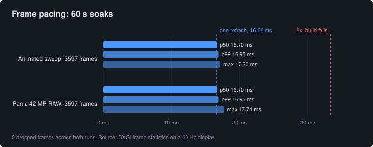

**First pixel.** Embedded preview first. The grey bar is the full decode that replaces it.

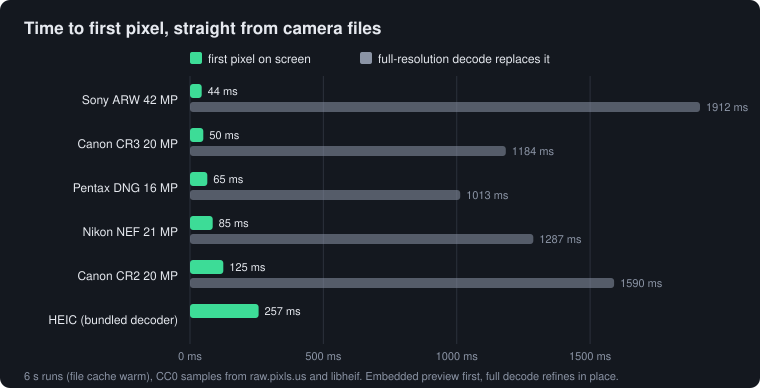

**Next photo.** Arrow after the neighbours have been decoded, and a jump to a photo that has not.

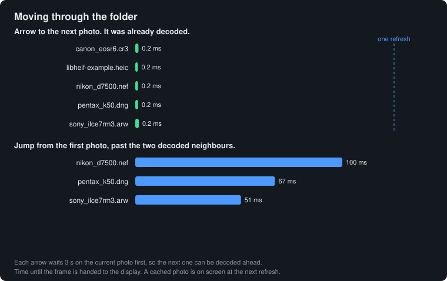

### Video

**On screen.** 60 s of 1080p HEVC. Frame time sits on the refresh. No present was dropped, and no video frame was skipped.

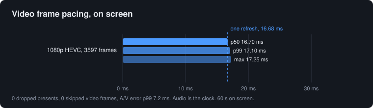

**Audio against video.** 120 s of the same kind of clip. The error stays under one frame of a 30 fps video (33.3 ms). The selector discarded 2 of 3,597 frames; that is not a dropped screen present.

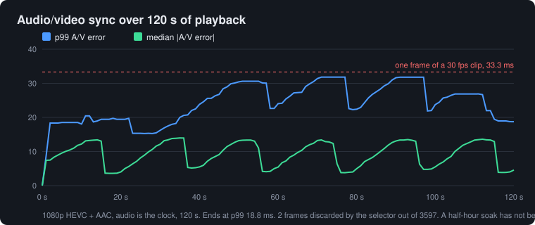

What is still slower than it should be: a full RAW decode takes 1.0–1.9 s behind the preview, and one timed Canon CR3 open dropped a frame while that preview cross-faded to the full image. A 4K HEVC test clip played at about 24 fps on screen, with a worst gap of 367 ms. Playback has been measured for one to two minutes, not yet a half hour. The folder chart is stills only.

### Against Windows Photos and Media Player

Same machine, same sample files, timed from the screen (a grab is about 17 ms). These are cold launches: the clock starts when the app is opened, so they are not the 44–125 ms in-app preview times above.

**Opening.** Two launches each. RAW is a tie. Photos is faster on the HEIC (810 ms vs 964 ms).

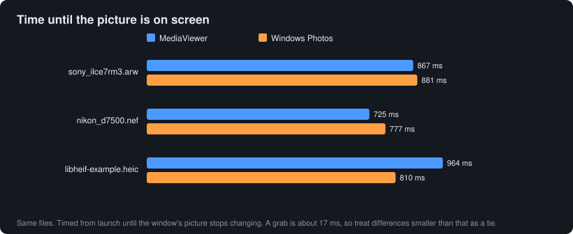

**Panning.** With the mouse, MediaViewer updates the picture about every refresh (p50 16.7 ms). The slowest updates were 49–84 ms. The same wheel-and-drag did not move the picture in Photos, so Photos has no pan number here.

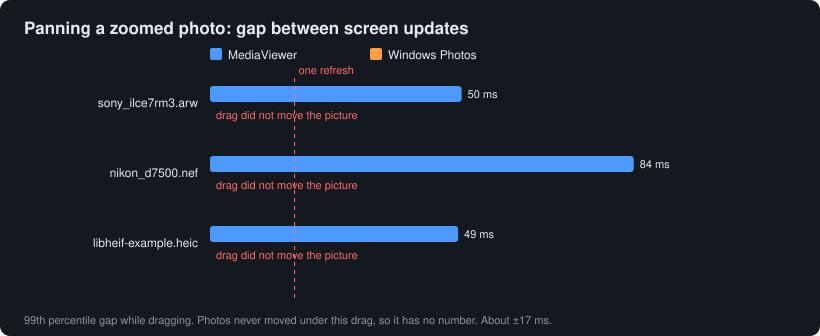

**Video.** On a 30 fps test clip both apps ran at 29 fps. Media Player's slow gaps were shorter (p99 44 ms, MediaViewer 66 ms). On a 4K HEVC clip MediaViewer averaged 24 fps; Media Player stayed on a single frame for the whole sample, so it has no playback number for that file.

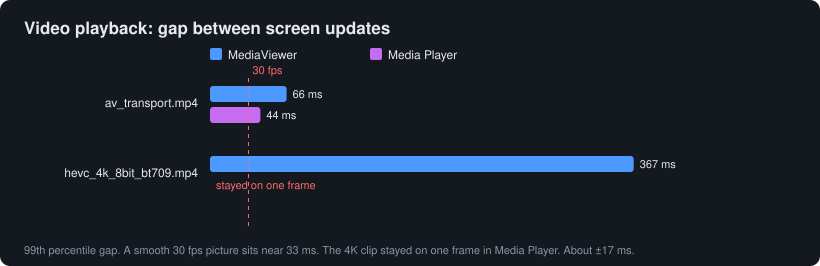

Charts are drawn by [`tools/perf/make-charts.py`](tools/perf/make-charts.py) from the reports in [`docs/perf/`](docs/perf/).

---

## Built for browsing a real dump

- **Everything in one folder.** JPEG, PNG, BMP, GIF, TIFF, WebP, HEIC, AVIF, ICO, camera RAW (CR2, CR3, NEF, ARW, DNG)
  and MP4, MOV, MKV, WebM, AVI, TS video open in the same window on the same canvas.
- **RAW+JPEG and Live Photo pairs are one entry**, one arrow-key stop, badged RAW or LIVE. Copy, move and delete act on both files.
- **Filmstrip and gallery.** A virtualised filmstrip on a persistent thumbnail cache; `G` opens a full grid.
- **Nested folders as tiles.** Child folders show with covers and counts, a path bar stays on screen, and
  `Ctrl+Up` goes up and returns to the folder you left. `Ctrl+Left` / `Ctrl+Right` hop to the neighbouring folder.
- **Folder tree** (`Ctrl+Shift+E`) and sort by name, date modified, size, type or EXIF date taken.
- **Fit, fill, 100 %, or any zoom.** Wheel zoom toward the cursor with springy, physical-feeling pan and zoom.
- **Animated GIF, APNG and WebP** play on the same frame clock.

| Gallery | Frame-time overlay (`F3`) |
|---|---|
| 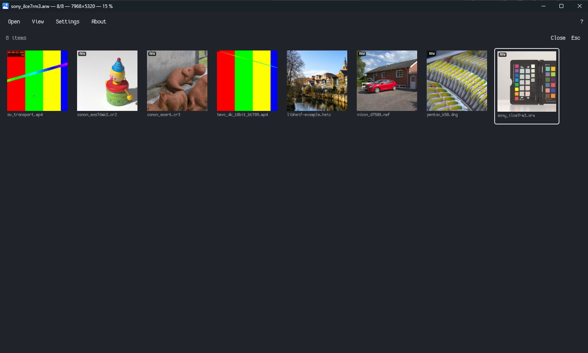 | 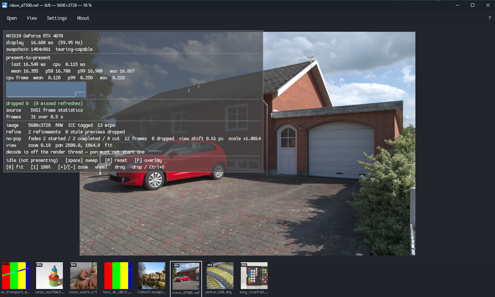 |

## Keyboard-complete

Every action has a key, and `?` shows the full list, generated from the same command table the app runs.
Arrow keys or `A`/`D` browse, `Space` advances, `Insert` marks, `F7`/`F8` copy or move marked files to a folder,
`Delete` sends to the Recycle Bin, `F11` goes fullscreen, `F5` starts a slideshow. Every key can be remapped in Settings (`Ctrl+,`).

## Video that lives with your photos

FFmpeg decode with D3D11 hardware acceleration on the same swapchain as photos. H.264, HEVC, VP9, AV1 and MPEG-2,
including 10-bit HDR clips mapped to SDR. Audio is the master clock. Seek, frame step (`,` `.`), speed
0.25x-4x, A-B loop, resume where you left off, and media keys. `;` plays a Live Photo's motion and returns to the still.

## Know your shot

`I` opens a metadata pane: a summary card, a searchable tree of every EXIF, IPTC and XMP tag, and a per-stream inspector
for clips. `O` overlays camera, exposure and date on the image, `Shift+O` draws autofocus points, and `Shift+I` is a
one-pixel colour eyedropper (`Ctrl+C` copies the value).

## Colour done right

Images are converted from their embedded ICC profile through a linear working space to sRGB. A tagged image is
never assumed to be sRGB, and camera JPEGs are never tone-mapped. HDR video is mapped to SDR.

## Trustworthy by design

- **Your originals are never modified.** Browsing is read-only; edits write new files or an XMP sidecar.
- **Nothing about your files leaves the machine.** Telemetry is opt-in and off by default. Crash reports are captured
  locally, scrubbed of paths, filenames and your username, and never sent without asking.
- **No codec packs.** Decoders are bundled; you never need the Store HEVC extension.
- **Installs per user**, with a public installer and a background updater. The 0.1.2 installer is not Authenticode-signed, so SmartScreen may warn once. It never takes over your file associations.
- **Hardened decoding.** A corpus of broken files and per-decoder fuzzers run in CI.

---

## Coming next

| Soon | |
|---|---|
| **Lossless rotate, crop and export** | Rotate and flip JPEGs without re-encoding, straighten and crop, export with metadata carried over |
| **Colour adjustments** | Exposure, contrast and white balance, non-destructive |
| **Metadata editing** | Rating, orientation and comments written safely, RAW ratings kept in sidecars |
| **Video trim, extract and remux** | Written (PR 13 / 14, above); first Windows and Mac builds and the hardware verify still owed |
| **Windows and macOS integration** (PR 15, started) | Explorer thumbnails and properties for HEIC and RAW, a Spotlight importer for RAW, a second open going to the running app as a new tab-grouped window, and drag-out of the edited photo. Copy path, copy edited image, Share, recent folders and media controls are in (above) |
| **Import** (optional add-on) | Copy cards with duplicate detection, verification, date-based folders, backups and resume. In the code base ([plan/18](plan/18-import.md)) and installed from Settings → Add-ons once a stable release carries it; hardware verify still owed |
| **Local AI search** (optional add-on) | Find "dog on a beach" across your dump, entirely on your machine |
| **Voice search** (optional add-on) | Speak the query; speech runs on-device |
| **macOS** | The same core with a native Metal and SwiftUI app; it already builds, browses and plays video, and is being brought to parity |

## From source

Building needs Visual Studio 2022, CMake 3.28+, vcpkg and the .NET 8 SDK. The first configure builds FFmpeg and takes a while. Commands, tests and the macOS recipe are in [docs/DEVELOPMENT.md](docs/DEVELOPMENT.md).

```powershell
git clone https://github.com/longtimeno-c/mediaviewer
cd mediaviewer
cmake -S . -B build -G "Visual Studio 17 2022" -A x64
cmake --build build --config Release
.\build\bin\Release\mediaviewer_lab.exe C:\path\to\photos
```

Reproduce the charts with `.\build\bin\Release\frametime.exe --seconds 60`, then `python tools/perf/make-charts.py`. The folder chart is `mediaviewer_lab.exe --browse-soak --json docs\perf\browse.json path\to\folder`.

## Licence

```powershell
cmake -S . -B build-asan -A x64 -DMV_ASAN=ON     # AddressSanitizer
cmake -S . -B build-clang -A x64 -T ClangCL      # clang-cl, the CI second opinion
```

`-DMV_ASAN=ON` needs the **C++ AddressSanitizer** component
(`Microsoft.VisualStudio.Component.VC.ASAN`) in the Visual Studio Installer — the
ASan runtime is a DLL that ships beside `cl.exe` and nowhere else. The build
copies it next to every executable, so `ctest` and a double-click both work
outside a developer prompt. Configure says so and stops if the component is
missing, rather than producing a tree whose every test hangs for its full
timeout with nothing in the log.

### macOS (Mac PRs 1–6)

Apple Silicon, macOS 14+, CMake ≥ 3.28, vcpkg, a full Xcode install (Command Line
Tools alone are not enough — `swift build`'s SwiftUI target and `xcrun metal` both
need it), Swift 6. Intel Macs are out of scope (D9). This path builds the native
Mac app and its dynamic FFmpeg libraries; it does not build WinUI or the Windows lab.

```sh
export VCPKG_ROOT=/path/to/vcpkg   # bootstrapped
# Dynamic LGPL codecs use a separate manifest/tree; CMake installs the static
# permissive dependencies from the root manifest. See RELEASING.md.
"$VCPKG_ROOT/vcpkg" install --triplet arm64-osx-dynamic \
  --x-manifest-root="$PWD/tools/mac/dependencies" \
  --x-install-root="$PWD/build/vcpkg_dynamic"
cmake -S . -B build -G Ninja -DCMAKE_BUILD_TYPE=Release \
  -DCMAKE_TOOLCHAIN_FILE="$VCPKG_ROOT/scripts/buildsystems/vcpkg.cmake" \
  -DVCPKG_TARGET_TRIPLET=arm64-osx \
  -DMV_VCPKG_DYNAMIC_PREFIX="$PWD/build/vcpkg_dynamic/arm64-osx-dynamic"
cmake --build build
./build/bin/mediaviewer_lab --open some.jpg
./build/bin/frametime --seconds 60 --lab ./build/bin/mediaviewer_lab
ctest --test-dir build --output-on-failure
```

This has been built and linked for real (not just reviewed) with `cmake` + `ninja` +
a manifest-mode `vcpkg` install (`imgui[metal-binding]`, `libjpeg-turbo`, `libspng`,
`lcms`, `sqlite3`, `catch2`) and `swift build` for the SwiftUI chrome — `mv_tests`
passes (210 assertions, 60 cases). **The macOS SDK matters**: once the filmstrip/gallery
pulled in SwiftUI's `Lazy*Stack`, linking against an SDK that doesn't match the Swift
toolchain's own SDK failed with "cannot link directly with 'SwiftUICore'" — use
`xcrun --show-sdk-path` (or the SDK your installed Xcode ships) rather than an older one
you may have lying around for a lower deployment target; `CMAKE_OSX_DEPLOYMENT_TARGET`
stays 14.0 either way. On a real display (2026-09-19) `frametime --seconds 60` passes with the SwiftUI chrome
on screen (3600 frames, 0 dropped, p99 16.9 ms, idle 0.14 % of one core, 0 presents). Not yet
exercised by hand: drag-and-drop, copy/move/Trash and slideshow on real folders — do a manual
pass before trusting them. Thumbnails are cached in `~/Library/Caches/MediaViewer/thumbs`,
never in the folder being browsed.

The whole D5 still set decodes on Mac: JPEG, PNG, BMP, GIF, APNG, TIFF, WebP, ICO, HEIC/HEIF,
AVIF, and camera RAW (CR2/CR3/NEF/ARW/DNG through LibRaw). Verified on real files (the CC0
RAW set in `tools/testmedia/raw-manifest.json`, the libheif example HEIC) plus generated
samples: every format thumbnails and opens on the canvas, and `mv_tests` runs the codec tests
including the RAW ones ("original bytes unchanged", cancel latency) when
`tools/testmedia/raw/` and `heif/` are populated (they skip otherwise; `fetch-raw.ps1` is the
Windows fetcher, the manifests are plain JSON). A JPEG or RAW shows its preview first (JPEG
DCT 1/4, or the RAW's embedded JPEG: about 100 ms on a 42 MP ARW) and the full decode
(about 5 s for that ARW) replaces it in place. HEIC always uses the bundled libheif here; an
ImageIO fast path is a later change to `codec/os_decode_mac.cpp`.

The Mac has a real menu bar (File / View / Go / Window / Help), `?` opens a shortcuts sheet,
and in the gallery `↑`/`↓`/`W`/`S` move by row, `Enter` opens the selection and `+`/`-` resize the
thumbnails.

**Video on Mac (Mac PR 5).** FFmpeg is LGPL and dynamic-link only. The dynamic manifest
installed above includes it alongside libheif/LibRaw; no extra install is needed.

Open a folder with clips in it. `Space`/`K` play/pause, `,` `.` frame step, `Q`/`E` ±2 s,
`J`/`L` ±10 s, `Shift+Q`/`Shift+E` speed 0.25–4×, `Shift+M` mute (`?` lists them; the transport
strip appears above the filmstrip while a clip is on screen). `F3` names the decoder that is
*actually* running (`SOFTWARE` is spelled out, never silent), the clock source, the A/V error
and the counters. H.264 and HEVC (8- and 10-bit) decode in hardware; MPEG-2 and MPEG-4 fall
back to software on Apple Silicon and say so.

`playprobe` is the headless pipeline check — it plays a clip on the system `MTLDevice` against
a 60 Hz timer and prints the decoder used, the presenter counters and the drift slope:

```sh
./build-darwin/bin/playprobe clip.mov --seconds 30 --expect hw --mute
```

Verified on an Apple Silicon Mac with generated clips (H.264, 4K60 10-bit HEVC, an HLG-tagged
HEVC, MPEG-2 TS, MKV, AVI, no audio): 4K60 10-bit HEVC plays at full rate through VideoToolbox
(P010 path) with 0 dropped frames; skip and frame-step land on the exact frame against a
burned-in timecode; repeated photo ↔ video navigation leaves memory and thread count flat.
Not yet verified: an iPhone HLG capture (only a synthetic HLG-tagged clip), VP9/AV1/WebM (no
encoder in the LGPL build to make a clip), and audio-device hot-swap.

`frametime` on Darwin requires `drop_source` `Metal display-link`. Copying a
Windows DXGI JSON report over is a failed gate, not a pass.

`F3` toggles the overlay, `Space` advances the folder (or pauses a running slideshow),
`R` resets the frame-time measurement, `Esc` closes the gallery / leaves fullscreen or
slideshow / quits, `0`–`4` are the zoom presets, `T`/`G` toggle the filmstrip/gallery,
`F11`/`F` fullscreen, `F5` starts a stills slideshow. Idle (`--static`) must park the
cursor off the window.

### MediaViewer.app and a shippable Mac build (Mac PR 8)

`mediaviewer_lab` stays the bare instrument `frametime` drives. The same sources also
build `MediaViewer`, the executable inside **MediaViewer.app**:

```sh
# a local, ad-hoc-signed bundle (no updater unless a key is given)
cmake --build build-darwin --target mediaviewer_app
open build-darwin/MediaViewer.app
```

The bundle holds the app, `MediaViewerThumbnails.appex` (Finder thumbnails for the D5
still set, run by Quick Look in its own sandboxed process, never inside Finder), the LGPL
dylibs in `Contents/Frameworks`, and, when configured, Sparkle. It registers the D5 still
and video types at rank *Alternate*: MediaViewer shows up in Finder's **Open With** and never
makes itself the default merely by being installed. First launch shows a setup sheet with
*Use MediaViewer for all supported photos and videos* checked. Continue applies that choice
through macOS; untick it or choose Not Now to keep current defaults. The MediaViewer menu
has the same command for later, and updates preserve the previous setup choice.

#### Runbook: build, sign, release, update (macOS)

Everything below was run end to end on Apple Silicon except notarization and Sparkle,
which need your Apple credentials — those steps say so. `plan/13` is the design; this is
the procedure.

**0. Prerequisites (once per machine)**

| Need | Notes |
|---|---|
| Full Xcode, macOS 14+ | Command Line Tools alone are not enough (Swift/SwiftUI, `xcrun metal`, `notarytool`) |
| CMake ≥ 3.28 | `python3 -m pip install --user cmake` puts it in `~/Library/Python/3.x/bin` — add that to `PATH` |
| Ninja | vcpkg downloads one under `$VCPKG_ROOT/downloads/tools`; or `brew install ninja` |
| vcpkg, bootstrapped | `export VCPKG_ROOT=…`. The baseline is pinned in `vcpkg.json`; do not float it |
| Python 3.10+ | for `dmgbuild==1.6.7` (`pip install -r tools/mac/requirements.txt`). On 3.9, `dmgbuild==1.6.5` works for a local dry run only |
| Apple Developer Program | needed for Developer ID signing and notarization; without it you can only build the ad-hoc bundle |

**1. Build the app**

```sh
export VCPKG_ROOT=/path/to/vcpkg
"$VCPKG_ROOT/vcpkg" install --triplet arm64-osx-dynamic \
  --x-manifest-root="$PWD/tools/mac/dependencies" \
  --x-install-root="$PWD/build-darwin/vcpkg_dynamic"

cmake -S . -B build-darwin -G Ninja \
  -DCMAKE_TOOLCHAIN_FILE="$VCPKG_ROOT/scripts/buildsystems/vcpkg.cmake" \
  -DCMAKE_BUILD_TYPE=Release \
  -DVCPKG_TARGET_TRIPLET=arm64-osx \
  -DMV_VCPKG_DYNAMIC_PREFIX="$PWD/build-darwin/vcpkg_dynamic/arm64-osx-dynamic"
cmake --build build-darwin --target mediaviewer_app
open build-darwin/MediaViewer.app
```

That is an ad-hoc-signed bundle: fine on this Mac, but **it will not launch once
re-signed ad hoc with the hardened runtime** (dyld rejects the bundled dylibs with
"different Team IDs"). Only a real Developer ID signature, which gives every binary in the
bundle the same Team ID, satisfies that check. `python3 tools/mac/check_plists.py` and
`python3 tools/mac/test_macpack.py` need no Mac and run anywhere.

**2. One-time signing and update setup**

1. *Developer ID Application certificate.* In Xcode: Settings → Accounts → your team →
   Manage Certificates → **+** → *Developer ID Application*. (By hand: create a CSR in
   Keychain Access, upload it at developer.apple.com → Certificates choosing **Developer ID
   Application** and the **G2 Sub-CA**, then double-click the downloaded `.cer`.) Keep the
   private key on this Mac. Never commit `.cer`, `.p12` or CSR files (they are gitignored).
2. *Apple's G2 intermediate.* If `security find-identity -v -p codesigning` shows "0 valid
   identities" although the certificate is installed, the chain is missing:
   `curl -LO https://www.apple.com/certificateauthority/DeveloperIDG2CA.cer` and
   `security import DeveloperIDG2CA.cer -k ~/Library/Keychains/login.keychain-db`.
   The identity string it then prints — `Developer ID Application: <Team name> (<TEAMID>)` —
   is what `--identity` takes.
3. *Notarization profile.* Create an app-specific password at appleid.apple.com, then
   `xcrun notarytool store-credentials mediaviewer-notary --apple-id <id> --team-id <TEAMID>`
   (it prompts for the password, so it never lands in shell history).
4. *Sparkle keys.* Download the Sparkle 2.9.6 release tarball, run
   `./Sparkle-2.9.6/bin/generate_keys`, and keep the printed **public key**. The private key
   lives in your login keychain: **back it up** (`generate_keys -x file`). Lose it and no
   installed copy can ever accept another update.

**3. Cut a release build**

Reconfigure with the updater's key, and raise the build number every release — Sparkle
compares `CFBundleVersion` (`MV_MAC_BUILD_NUMBER`, default = the project version), so a
build that does not increase is never offered:

```sh
cmake -S . -B build-darwin -DMV_SPARKLE_PUBLIC_ED_KEY=<public key> -DMV_MAC_BUILD_NUMBER=<n>
cmake --build build-darwin --target mediaviewer_app     # fetches Sparkle into the bundle

# safe local rehearsal: signs and builds the .dmg/.zip, sends nothing to Apple
python3 tools/mac/macpack.py release --app build-darwin/MediaViewer.app \
    --identity "Developer ID Application: … (TEAMID)" --skip-notarize --allow-no-updater \
    --out-dir /tmp/mv-rehearsal

# the real thing: notarizes and staples the app and the image, and signs the appcast
cmake --build build-darwin --target mediaviewer_app     # release re-signs the app in place: rebuild first
python3 tools/mac/macpack.py release --app build-darwin/MediaViewer.app \
    --identity "Developer ID Application: … (TEAMID)" --notary-profile mediaviewer-notary \
    --sparkle-bin build-darwin/_deps/sparkle-2.9.6/bin \
    --download-url-prefix https://github.com/longtimeno-c/mediaviewer/releases/download/v<version>/
```

Output in `build/release` (or `--out-dir`): `MediaViewer-<version>.dmg` (drag to
Applications, the GPL shown on mount; opening the app straight from the image offers to
move it to Applications, relaunch it and eject the image), `updates/MediaViewer-<version>.zip` and
`updates/appcast.xml`. `--phased-rollout-seconds` spreads an update over time.
Notarization uploads the app and image to Apple and takes a few minutes; without a
`--sparkle-bin` no appcast is written.

**4. Verify the artefacts**

```sh
codesign --verify --deep --strict --verbose=2 build-darwin/MediaViewer.app
spctl --assess --type execute --verbose=2 build-darwin/MediaViewer.app     # "Notarized Developer ID"
xcrun stapler validate build/release/MediaViewer-<version>.dmg
# the image has a licence page, so a headless mount must accept it:
mkdir /tmp/mvdmg && yes | hdiutil attach -nobrowse -readonly -mountpoint /tmp/mvdmg build/release/*.dmg
ls /tmp/mvdmg            # MediaViewer.app  Applications
hdiutil detach /tmp/mvdmg
```

Copy the app out with `ditto --norsrc --noextattr`, not `cp`/`ditto` defaults; Finder
metadata copied along invalidates the signature. Then open a photo and a clip from the
copy, and check Finder's **Open With** and a Quick Look thumbnail.

**5. Publish, and later update**

1. Tag and create a GitHub release `v<version>` and mark it **latest**: the app's feed is
   `…/releases/latest/download/appcast.xml`. Upload the `.dmg`, the `.zip` and
   `appcast.xml`.
2. To ship a new version: bump `project(… VERSION x.y.z)` in `CMakeLists.txt` (the marketing
   version), raise `MV_MAC_BUILD_NUMBER`, rebuild `mediaviewer_app`, rerun step 3 with the
   new `v<version>` in `--download-url-prefix`, and upload the new files to a new release.
   Keep earlier zips in `updates/` so `generate_appcast` keeps them in the feed.
3. Test the update path before announcing: install the *previous* release from its `.dmg`,
   publish the new one, and confirm the old build offers **Update ready — restart**.
   Installed copies accept only a feed and archive signed with the key baked in at build
   time.
4. First install is the disk image; every update after that is the zip, applied by Sparkle
   on **Update ready — restart** or on quit.

`python3 tools/mac/check_plists.py` and `python3 tools/mac/test_macpack.py` need no Mac and run anywhere.

## Run

```powershell
.\build\bin\Release\mediaviewer_lab.exe
.\build\bin\Release\mediaviewer_lab.exe path\to\photo.jpg
.\build\bin\Release\mediaviewer_lab.exe path\to\folder
```

| Key | |
|---|---|
| `F11` / `F` | fullscreen on the window's monitor; also available from View → Full screen. Hides the command bar, filmstrip and transport. `Esc` leaves |
| `F3` | frame-time overlay — off at launch on Windows and macOS unless a soak is running |
| Empty-window runner | `Space` starts/jumps/retries; `3` switches between the default 2D view and a shaded 3D view; `Esc` leaves with a short outro. Switching views keeps your run and score |
| `Space` / `Backspace` | next / previous. On a clip, `Space` is play/pause. It is no longer the lab sweep |
| `Home` / `End` | first / last in the folder |
| `PageUp` / `PageDown` | back / forward ten |
| `J` / `K` / `L` | clip transport: −10 s / pause / +10 s ([plan/16](plan/16-commands.md)) |
| `,` / `.` | frame step back / forward while paused |
| `A` / `D` | previous / next beside the arrows, in every mode including on a clip |
| `Q` / `E` | on a clip, two commands on one key: **tap** skips ±2 s, **hold** skims ±2 s per key repeat and settles on an exact seek when released. `Shift+Q` / `Shift+E` step playback speed. Off a clip they do nothing |
| `R` | reset the measurement window |
| `0` | fit to window |
| `1` | 100 % |
| `2` / `3` | 200 % / 400 % |
| `4` | fill: the image covers the canvas |
| `Ctrl+0` | reset pan and zoom (fit) |
| `Up` / `Down`, `Shift+arrows` | pan when zoomed in (`Left` / `Right` alone still walk the folder) |
| `S` | sticky zoom: keep zoom and position when you move to the next item (off by default) |
| hold `Z` | loupe: 100 % (or 2x the current zoom) around the cursor |
| hold `\` | show the previous image, for picking between burst frames |
| `B` | canvas background: dark / gray / white / checkerboard |
| `C` | clipping blinkies (red highlights, blue shadows). The canvas keeps presenting while on |
| `O` | info line: file name, position in the folder, size, zoom |
| `Ctrl+Shift+A` | always on top |
| `Insert` / `Shift+Space` | mark or unmark the current item. `Ctrl+A` marks all, `Ctrl+D` clears |
| `F5` | slideshow (fullscreen). In it: `Space` pause, `+` / `-` interval, `.` blackout, `R` shuffle, `Esc` leave. A clip plays to its end before advancing |
| `F7` / `F8` | copy / move the marked items (or the current one) to the last folder used. `Shift+F7` / `Shift+F8` pick a folder. Never overwrites: a taken name becomes `name (2).ext` |
| `Delete` | move the marked items (or the current one) to the Recycle Bin, after asking. A drive with no Recycle Bin is refused, never deleted permanently |

Drop files or a folder on the window, the gallery, or the filmstrip. Drag a
thumbnail or the current image (at fit) out to Explorer or another app. Pass
paths on the command line: the first one that exists opens (a file opens its
folder with that file selected).
Files added to or removed from the open folder show up without a restart.

A one-pixel grid appears at 400 % and above.
| `+` / `-` | zoom in / out (`=` and the numpad keys too) |
| `Ctrl+O` | open a photo or a clip (JPEG/PNG/BMP/GIF/WebP/TIFF/ICO/HEIC/AVIF/RAW, MP4/MOV/MKV/WebM/AVI/TS) |
| `Ctrl+Shift+O` | open a folder |
| `Ctrl+E` | show the current file in Explorer, selected. Open menu: **Open: filename** |
| `Space` / `,` / `.` on an animation | play or pause (a finished one plays again) / previous frame / next frame, like a clip. Delays follow browsers: 10 ms or less plays as 100 ms |
| `?` | the shortcuts for what you are doing right now. Also the `?` button on the right of the command bar |
| `Ctrl+,` | Settings: **General** has grouped preferences with aligned switches and automatic saving; **Keyboard shortcuts** has the searchable remapping list. Both pages scroll independently of the header and Done button. Search the list by command or shortcut. Choose a shortcut and press its replacement; viewer shortcuts are suspended while Settings is open. Escape or Cancel change cancels capture; Escape otherwise closes Settings. Conflicts swap shortcuts, and Reset to default restores the map. `?` lists whatever you bind |
| `Ctrl+G` | go to an item by its number in the folder |
| `/` | find an item by name. With the filmstrip or gallery focused, just type |
| `I` | metadata pane: summary card, searchable tag tree, and for clips the per-stream inspector (PR 9). Focuses the pane; `Esc` returns to the photo, a second `Esc` closes it |
| `Ctrl+Shift+E` | folder tree, rooted at the open folder (PR 9). Focuses it: arrows walk, Right / Left open and close a folder, `Enter` opens it, `Esc` returns to the photo. It follows the folder as subfolders come and go |
| `O` / `Shift+O` / `Shift+I` | info overlay with exposure lines / AF points / eyedropper (PR 9) |
| `Ctrl+C` | copy the eyedropper colour if it is on, otherwise the marked (or current) file(s) |

The title bar shows the current file, its position in the folder, its size and
the zoom. Arrow keys, `Space` and the slideshow wrap from the last item to the
first; turn that off under Settings.
| `Ctrl+Shift+O` | open a folder |
| `Left` / `Right` | previous / next in the folder |
| `G` | gallery: thumbnail grid of the folder. A folder of only folders uses big tiles; a mixed folder keeps a short chip row above the photos. Covers, counts, and a path bar stay on screen. Labelled **Up** and **Root** buttons stay outside the scrolling trail: Up opens the enclosing folder; Root returns to the highest folder reached in this browsing session (the first breadcrumb). The `…` menu opens hidden parent folders directly. Full paths are available on hover. These controls remain available, including while a photo is open. `Ctrl+Up` goes up and selects the folder you left; `Ctrl+Left` / `Ctrl+Right` open the sibling beside it. `/` on the folder row finds a tile by name. `W` / `S` or Up / Down move between rows and cross from folders to images; `A` / `D` or Left / Right move between items. `+` / `-` enlarge / shrink thumbnails (`=` also enlarges). `Enter` opens a folder or the selected image. A click does the same; `Esc` leaves |
| `T` | filmstrip show/hide, for the mode you are in (folder open or single image) |
| `Tab` | focus the command bar island |
| `Esc` | walks out one level: gallery, fullscreen, then island focus back to the canvas. It never quits |
| `Ctrl+W` / `Alt+F4` | close the window |

**Editing (PR 10, Windows and macOS).** Edits are kept per file for the session; the
original is only ever rewritten by a lossless JPEG rotate / flip.

| Key | Does |
|---|---|
| `[` / `]` | rotate left / right. On a JPEG with no other edit, the file is rewritten losslessly 0.4 s after the last press |
| `H` / `V` | flip horizontal / vertical (same lossless rule) |
| `Shift+C` | crop / straighten. Arrows move the crop, `Shift`+arrows resize it, `,` / `.` straighten by 0.5°, `Enter` applies, `Esc` cancels |
| `Ctrl+Z` / `Ctrl+R` | undo the last edit / reset to the original |
| `Ctrl+S` | export dialog: JPEG / PNG, quality, long edge, metadata (all / no GPS / none). `↑` `↓` choose, `←` `→` change, `Enter` exports to `<name>-edit.jpg` beside the original; never overwrites |
| `Shift+A` | adjust pane (PR 11): exposure, contrast, saturation, temperature, tint, histogram and clipping. It takes the keyboard: on Windows `Tab` walks the sliders and the arrows step them; on Mac `↑` `↓` pick a slider, `←` `→` step it (`⇧` ×10), `0` zeroes it, `R` resets. `Esc` hands the keyboard back to the photo; `Shift+A` again closes the pane. A slider drag is one `Ctrl+Z`. Colour never rewrites the file: a JPEG with a colour edit keeps `[` `]` in the stack for export |

**Clips (PR 13 / 14, Windows and macOS; not yet built on either).** Nothing here changes the
clip: every result is a new file beside it, and a cancelled job leaves nothing behind.

| Key | Does |
|---|---|
| `Ctrl+T` | trim mode on the clip on screen. Transport keys keep working; `Esc` leaves it (markers are kept for that clip) |
| `[` / `]` | in / out marker at the playhead. The scrub bar shows the markers, the keyframe grid and the range the instant cut keeps |
| `P` | preview the cut: loops exactly what `Enter` will write |
| `Enter` / `Shift+Enter` | save the keyframe cut (instant, lossless, snapped to keyframes) / the frame-accurate re-encode on the hardware encoder (slower) |
| `Ctrl+X` | save a copy without the in–out range |
| `Ctrl+←` / `Ctrl+→` | previous / next keyframe (in trim mode) |
| `Backspace` / `Delete` | clear the markers (in trim mode `Delete` never trashes the clip) |
| `Ctrl+S` | clip tools: rotate losslessly, split, save the frame (PNG / JPEG), extract audio (copy / WAV / FLAC), convert MP4 ↔ MKV, GIF / WebP of in–out (or 5 s from the playhead) |
| `Ctrl+B` | split at the nearest keyframe to the playhead |
| `Ctrl+J` | Jobs pane: progress and time left; `↑` `↓` choose, `Delete` cancels, `R` retries, `Enter` shows the output in Explorer / Finder |

On a Mac these are the `⌘` chords.

Colour edits are worked in linear light (an FP16 working image, D6) and shown through the
same shader on both platforms; `C` blinks what the edit clips. A RAW's sliders wait for
LibRaw's full linear develop (seconds on a large file) rather than editing the embedded
JPEG, so what you adjust is what exports.

Keys go through one router and one table (`src/shell/commands.h`,
[plan/16](plan/16-commands.md)). Symbol keys (`?`, `+`, `\`) follow your
keyboard layout, not a US key position.

Wheel zooms toward the cursor; drag pans. Zoom-out floors at 50 % (Fit can
still go smaller on a huge image) and rubber-bands a little past that, then
springs back to centre. Drop a file on the window.

Command line: `--soak <seconds>`, `--json <path>`, `--gate` (non-zero exit if the verify
line fails), `--no-overlay`, `--static`, `--no-chrome`, `--open <path>`,
`--av-soak <seconds> --csv <path>` (headless A/V drift soak on a clip — see
[Test](#test)), `--pan-soak` (with `--soak` and `--open`: pan the still at 100 % across
the whole frame on a fixed path, to measure cached-image and tiled-pyramid pan), or a
positional file or folder.

A still's first pixel is a preview (JPEG DCT 1/4, or a RAW's embedded JPEG); the full
decode then *refines* the same item rather than replacing it: the view you have — fit,
or a zoom and pan made while it loaded — is kept as a fraction of the image, and the
full texture cross-fades in over 80 ms (up to 250 ms when the preview and the full
render differ a lot in brightness, as a RAW's embedded JPEG and LibRaw's render do).
Images above ~64 MP, or wider or taller than 16384 px, are shown as a tiled pyramid: a
≤ 2048 px overview is always loaded, and 256 px tiles for the part on screen are
created a few per refresh and drawn over it, so a fast zoom or pan is blurry for a
moment, never blank. `F` / `F3` shows the tile LOD, resident tiles and VRAM, create
times, and refinement counters. The command bar is also on the island: Open (**Media…** or **Folder…** — the picker
takes photos and clips), View (zoom in/out,
fit, 50 / 100 / 200 / 400 %, gallery, filmstrip, overlay), a playback-speed dropdown,
a `?` shortcuts button, Settings (`Ctrl+,`: view defaults and remappable keys), About.
The filmstrip along
the bottom and the gallery grid are both `ItemsRepeater` islands over the same listing; the gallery also shows child-folder tiles (or a chip strip in a mixed folder) and a path bar (`Ctrl+Up` goes up, `Ctrl+Left`/`Ctrl+Right` the sibling). Thumbs are JPEG files from `%LocalAppData%\MediaViewer\thumbs`. Clips get a
thumbnail too — a poster frame from about 10 % into the clip, in that same cache — so a
camera dump does not show blanks where the video is. With no
folder open the canvas shows a welcome card (drop target, open shortcut, formats, key legend) reading *Drop photos, videos or a folder here*, not the
present-lab sweep. **Space** on that empty view starts a small runner game (an intro animation, then
Space to jump, `Esc` to leave with a short outro); it stops presenting once the welcome card is back. The frame-time
soak (`--soak`) keeps the old sweep, which the present-loop gate measures. The gallery and filmstrip accept the same drop, and you can drag a
thumbnail or the fitted image out to Explorer.

The playback transport is a **third island**: a bottom-centre strip that appears with a
clip and goes away with it. Its height is reserved out of the canvas rectangle the same
way the filmstrip's is, so it can never cover the video ([plan/16](plan/16-commands.md):
do not grow an island over the canvas). Speed is owned by the core, so the dropdown and
the keyboard cannot disagree.

Opening a single image lists its folder too, so `Left` / `Right` and the gallery work on the
files beside it. Whether the filmstrip comes with it is a preference: **Settings** has
*Filmstrip when opening a folder* (on by default) and *Filmstrip when opening an image* (off),
persisted to `%LocalAppData%\MediaViewer\settings.ini` (also wrap, sticky zoom, canvas
background, and key remaps). `T` toggles the one for the mode you are in. Both take
effect immediately — no restart. The Settings screen groups these defaults under General,
with switches aligned on the right and descriptions on the left. Keyboard shortcuts has
its own searchable tab, so neither page is squeezed into a narrow column. Both platforms
keep the header and Done button visible while the content scrolls.

For the settings and path-bar smoke checks on Windows and macOS, see
[the UI verification checklist](docs/settings-navigation-verify.md).

## Test

```powershell
# the video test corpus — REQUIRED for anything PR 5 claims to prove.
# The clips are gitignored (plan/09); only the generator is in the repo.
# Needs an ffmpeg on PATH (or $env:FFMPEG); NVENC is used when present,
# libx264/libx265/SVT-AV1 otherwise. ~1.5 GB, and the 31-minute clip is slow.
bash tools/testmedia/generate.sh          # --list to see what it makes
ctest --test-dir build -C Release -R corpus --output-on-failure   # confirm

# native unit tests and synthetic harness regression tests
ctest --test-dir build -C Release --output-on-failure

# ...and in CI, where an absent corpus must fail rather than skip
$env:MV_REQUIRE_CORPUS = "1"; ctest --test-dir build -C Release --output-on-failure

# the ABI, end to end from C#: SafeHandle, struct layout, completion drain
dotnet build src.managed\MediaViewer.AbiSmokeTest\MediaViewer.AbiSmokeTest.csproj -c Release
dotnet src.managed\MediaViewer.AbiSmokeTest\bin\Release\net8.0-windows\MediaViewer.AbiSmokeTest.dll build\bin\Release

# WinUI chrome (also published beside mediaviewer_lab.exe by the CMake build)
dotnet publish src.managed\MediaViewer.Chrome\MediaViewer.Chrome.csproj -c Release -r win-x64 --no-self-contained

# Milestone G: the Import add-on's suite (built with the core, both platforms)
ctest --test-dir build -C Release -R import_ --output-on-failure

# ...and the same engine headless on Linux or any POSIX machine (the
# portable-core CI job in tools/portable/ci-portable-core.patch; SQLite, libsodium, BLAKE3 and Catch2 from vcpkg via
# tools/portable/vcpkg.json, or the system):
#   cmake -S cmake/portable -B build-portable \
#     -DCMAKE_TOOLCHAIN_FILE=$VCPKG_ROOT/scripts/buildsystems/vcpkg.cmake \
#     -DVCPKG_MANIFEST_DIR=tools/portable
#   cmake --build build-portable && ctest --test-dir build-portable

# policy gates (all run in CI on every push)
.\tools\check-module-graph.ps1     # dependencies point downward only
.\tools\check-hostable-core.ps1    # D9: no windows.h / d3d11.h above gfx/
.\tools\licence-check.ps1          # no GPL FFmpeg, no software HEVC/AAC encoder

# PR 7 broken-file corpus: every seed in tests/data/seeds truncated, stomped,
# bit-flipped and given absurd dimensions, plus tests/data/broken, through every
# decode entry point. Fails on a crash, an escaped exception, a call over 5 s,
# or runaway memory. Part of plain ctest; this runs just that suite.
ctest --test-dir build -C Release -L broken --output-on-failure
$env:MV_BROKEN_FULL = "1"          # exhaustive sweep (nightly CI)
$env:MV_BROKEN_DUMP = "broken-dump" # write each failing input here
# seeds are synthetic and committed; regenerate with (needs Pillow, pillow-heif):
python tools\testmedia\make-seeds.py

# libFuzzer harnesses, one per decoder entry point (clang-cl + ASan)
cmake -S . -B build-fuzz -A x64 -T ClangCL -DMV_FUZZ=ON -DMV_BUILD_TESTS=OFF
cmake --build build-fuzz --config Release --target mv_fuzzers
.\tools\fuzz\run.ps1 -BuildDir build-fuzz -Seconds 60      # -Harness png,gif to pick

# PR 7 clean-VM gate: a HEIC decodes with MV_OS_CODEC=0, and the process has
# loaded libheif + libde265 and NO Media Foundation, WIC codec extension, or
# \WindowsApps\ module. Its own executable, because once mfplat.dll is in a
# process it never leaves and the assertion could not be made again.
ctest --test-dir build -C Release -L cleanvm --output-on-failure

# the frame-time gate — 60 seconds, needs a quiet machine
.\build\bin\Release\frametime.exe --seconds 60

# PR 7 no-pop gate: open a still that has a preview (a RAW, or any JPEG), soak,
# and fail if the preview → full swap popped — a cross-fade cut short, a view
# that jumped, or a frame dropped inside the fade. PR 1's cadence is judged on
# the same run, so a short run is diagnostic only.
.\build\bin\Release\frametime.exe --no-pop tools\testmedia\raw\canon_eos7dmk2.cr2 --seconds 62

# PR 5b's A/V drift soak. Writes a CSV of position, error percentiles, the
# least-squares drift slope and the present counters, one row a second.
# Under 1800 s it exits 4 and is DIAGNOSTIC ONLY — it is not the verify.
.\build\bin\Release\mediaviewer_lab.exe --av-soak 1860 --csv drift.csv `
  tools\testmedia\soak_31min_1080p_hevc_aac.mp4
```

### Crash reports (PR 7)

Native crashes are captured out-of-process by Crashpad into
`%LocalAppData%\MediaViewer\Crashes`. Nothing is uploaded. On the next launch the app
scrubs each dump: memory outside thread stacks is zeroed, and paths, media filenames and
your username are masked. Managed exceptions go to `Crashes\managed\`.
[plan/13](plan/13-updates-and-telemetry.md) has the details.

The PR 7 verify is "a deliberately-corrupted RAW produces a minidump containing no path,
filename, or pixel data". The crash hook only fires when **both** the environment variable
and the marker in the file are present.

```powershell
# 1. a marked COPY of a real RAW, in PRIVATE_FOLDER_canary\SECRET_FILENAME_canary_7Q3.dng
.\tools\make-crash-raw.ps1 -Source tools\testmedia\raw\pentax_k50.dng

# 2. crash on it
$env:MV_CRASH_TEST = 'decode'
.\build\bin\Release\mediaviewer_lab.exe --open "$env:LOCALAPPDATA\Temp\mv-crash-canary\PRIVATE_FOLDER_canary\SECRET_FILENAME_canary_7Q3.dng"
Remove-Item Env:MV_CRASH_TEST

# 3. scrub: relaunch the app (it scrubs on start), or run the standalone tool
.\build\bin\Release\mv_minidump_scrub.exe <in.dmp> <out.dmp>

# 4. scan; exit 0 = PASS
.\tools\minidump-scan.ps1 -Dump <out.dmp> -Forbidden '<canary path>','SECRET_FILENAME_canary_7Q3','PRIVATE_FOLDER_canary',$env:USERNAME

# pixel data: run make-crash-raw.ps1 with no -Source. It writes a pattern BMP pair and
# prints the byte patterns. Open SECRET_COMPANION_canary.bmp instead; neighbour prefetch
# crashes on the canary. Pass the printed patterns to the scan as -PixelHex.
```

#### macOS (PR 11)

Crashpad's `crashpad_handler` runs out of process (`MediaViewer.app/Contents/Helpers`, or
beside `mediaviewer_lab`). Dumps go to `~/Library/Application Support/MediaViewer/Crashes`;
nothing is uploaded, and forwarding to Apple's crash reporter is off. The next launch
scrubs each dump with the Windows scrub, which also masks POSIX paths under `/Users`,
`/Volumes`, `/private`, … and the short and full user name and computer name. An uncaught
`NSException` from the chrome is written, scrubbed, to `Crashes/chrome/` with the
correlation id of the native call in flight; the dump carries the same id
(`mv_last_call_cid`). The verify, with `tools/mac/crash_canary.py` in place of the two
PowerShell scripts:

```sh
# 1. a marked COPY of a real RAW (or no --source: the pixel-pattern BMP pair)
python3 tools/mac/crash_canary.py make --source tools/testmedia/raw/pentax_k50.dng

# 2. crash on it, then relaunch normally: the relaunch scrubs the dump
MV_CRASH_TEST=decode build/MediaViewer.app/Contents/MacOS/MediaViewer \
    /tmp/mv-crash-canary/PRIVATE_FOLDER_canary/SECRET_FILENAME_canary_7Q3.dng
open build/MediaViewer.app

# 3. scan; exit 0 = PASS (it also fails a dump the app has not scrubbed yet)
python3 tools/mac/crash_canary.py scan ~/Library/Application\ Support/MediaViewer/Crashes/*/*.dmp \
    --forbid SECRET_FILENAME_canary_7Q3 --forbid PRIVATE_FOLDER_canary --forbid "$USER"

# the chrome path: an NSException raised in AppKit event handling, or a Swift trap
MV_CRASH_TEST=nsexception build/MediaViewer.app/Contents/MacOS/MediaViewer
MV_CRASH_TEST=swift_trap  build/MediaViewer.app/Contents/MacOS/MediaViewer
```

`--av-soak` exits 0 only on a run of 1800 s or more whose drift slope stays
within 1 ms/min, with no position discontinuities and no host-clock gaps; 1 is a
real failure, 3 means the clip ended early, 4 means the run was too short to
count. Audio must be the master for a clip that has an audio track, or it fails.

**The drift figure only means something with the audio master.** On a clip with no
audio track the clock falls back to the host (`clock host fallback` in the F3
overlay) and the slope is measuring the host clock against itself, so a large
number there — tens of ms/min — is an artefact of the fallback, not a defect. Read
the `audio_master` column in the CSV before reading the slope. That is the whole
reason the corpus now carries an audio-bearing 31-minute clip.

## Package and install (PR 8)

> Cutting a release, and how updates reach people who already installed:
> **[RELEASING.md](RELEASING.md)**. The short version — the wizard is a one-time
> download, and every update after it arrives in-app from GitHub Releases.

The v1 release is a **per-user** install under `%LocalAppData%\MediaViewer`, with **no
UAC** at any point. `Program Files` is not offered: a per-machine install needs elevation
for every update, which is how update mechanisms stop working
([plan/13](plan/13-updates-and-telemetry.md)). There is no Microsoft Store channel — the
app is GPL-2.0-or-later ([plan/11](plan/11-licensing.md)).

First install is an Inno Setup wizard; every later update is Velopack, in the background,
never re-opening the wizard.

### Building the release artefacts

Needs a built Release tree, plus two tools that are not in the repo:

```powershell
dotnet tool install -g vpk --version 1.2.0
winget install JRSoftware.InnoSetup

cmake -S . -B build -G "Visual Studio 17 2022" -A x64
cmake --build build --config Release
.\tools\package\build-release.ps1 -BuildDir build
```

That writes `dist\releases\` (the Velopack release set and the update manifest) and
`dist\MediaViewer-<version>-Setup.exe` (the wizard). It refuses to proceed if the app
breaks plan/09's 250 MB cap, fails plan/11's licence gate, or contains the Windows App SDK
AI / ONNX / DirectML / WebView2 files plan/13 forbids shipping.

The first run downloads the pinned .NET runtime (31.7 MB) once and caches it in the build
directory; its SHA-256 is verified every time. For an offline build, pass the same archive
with `-DotnetRuntimeZip`.

**No prerequisites on the target machine.** The payload carries both runtimes — the
Windows App SDK and .NET — so a clean Windows 10 21H2 install runs it with nothing
installed first. That is not a nicety: the wizard is per-user and takes no UAC, and a
machine-wide runtime prerequisite needs admin. plan/09 made the same call for .NET — "a
viewer whose whole pitch is 'point it at a folder and it works' cannot open with a runtime
prerequisite dialog". The app is **208.6 MB**, inside plan/09's stated 200–250 MB band; a
first install occupies **292.7 MB** on disk, because Velopack also keeps one full package
so a bad update can be rolled back.

**An artefact from that command is unsigned and not publishable.** It says so on its last
line. Signing needs credentials the repo does not and must not hold:

```powershell
.\tools\package\build-release.ps1 -BuildDir build `
  -SigningMetadata trusted-signing.json `     # Azure Trusted Signing
  -ManifestKey C:\offline\release.key         # Ed25519, signs the update manifest
```

Without Authenticode, Windows SmartScreen may warn. Without a correctly signed update
manifest, clients reject updates. The production public key is already pinned in
`src.managed/MediaViewer.Updater/UpdateKeys.cs`; preserve its matching private key.

### Continuous integration

Pushes to `main` and pull requests build four Windows variants (MSVC Release, MSVC Debug, clang-cl, ASan), run the C# ABI smoke test, and fuzz each decoder for a minute. A newer push to the same branch cancels the run it replaces. Dependencies are installed by one job and reused. The first run after `vcpkg.json` or the pinned vcpkg baseline changes spends about 45 minutes there, mostly building FFmpeg. Later runs restore that cache. The nightly schedule is the long fuzz run, separate from pull requests.

### Releasing from CI

Use **Actions → Release → Run workflow**. Pushes and tags do not start release packaging.
Both platforms use the exact `x.y.z` from `CMakeLists.txt`.

| Mode | Result |
|---|---|
| `artifacts` | Unsigned installers in Actions artifacts; no GitHub Release |
| `preview` | Both unsigned test installers on GitHub Releases as a prerelease |
| `stable` | Windows installer, notarized Mac image, both signed update feeds and checksums on Latest |

Windows and macOS build independently; a final job publishes only after both succeed.
Stable needs the Windows manifest key and six Mac signing/notarization secrets.
Windows Authenticode remains optional. Preview needs no signing secrets; its Mac app
must be replaced manually with a stable build later.

See **[RELEASING.md](RELEASING.md)** for commands, credentials, assets, version rules and
recovery steps. There is no automatic publishing on push or run-number version stamping.

### Installing and uninstalling

The wizard is six pages and no more: Welcome, Licence (GPL, scroll and accept), Location,
Options (Start Menu **on**, Desktop **off**), Progress, Finish (Launch, GitHub, Licence, and
a checked *Choose MediaViewer as the default for all supported photos and videos*).
It registers MediaViewer for the D5 photo and video types (per-user, removed on uninstall),
so it appears in **Open with** and in Settings > Default apps. Windows does not let an
installer set the default itself: leave the Finish-page box checked to open Default apps on
MediaViewer and confirm there, or untick it to skip. It does **not** ask about telemetry, which is a first-run
screen inside the app.

Uninstall is from Apps & features, and removes the shortcuts, the registry entry and the
whole install directory.

```powershell
# unattended, e.g. on a test VM
.\dist\MediaViewer-0.1.0-Setup.exe /VERYSILENT /DIR="C:\path\to\install" /TASKS=startmenu
```

### Updates

```powershell
# the local end-to-end check: staging, signature rejection, and rollback
.\tools\package\e2e-update.ps1 -Payload .\build\bin\Release
```

It packs three versions into a temp feed, installs one, proves a **tampered manifest
stages nothing**, proves a signed one downloads in the background and applies on exit
without showing the wizard, and proves a build that fails to start twice **rolls back** to
its predecessor on the third try.

### Telemetry

**Off by default, and it stays off unless you turn it on.** One first-run screen, two
buttons, neither preselected; dismissing it leaves telemetry off. Settings has the same
switch, and turning it off deletes the random install id and anything not yet sent.

Nothing about your files ever leaves the machine — no paths, filenames, folder names,
thumbnails, pixels or EXIF. That is enforced by the shape of the payload rather than by
care: an event is an id from a fixed table, a tag from a fixed vocabulary, and named
integers. There is no free-text field to put a filename in.
`tools/telemetry-schema-check.ps1` fails the build if that ever changes.

There is no upload endpoint yet, exactly as there is none for crash reports.

## Where this actually is

PR 1's verify line is:

> **Presents at exactly display refresh, 0 dropped frames over 60 s, ~0 % CPU idle.**

The earlier measurements do not establish this verify line: review found an assumed
60 Hz refresh rate, incomplete statistics coverage, and an idle-input bug. A 2026-09-07
re-run of the corrected instrument on the development box passed one 60 s animated soak
and dropped frames on another the same night; idle zero-presents was not established
while the window could receive mouse input. The harness must pass both soaks on the
intended GPU runner before PR 1 is considered verified. See
[plan/12-decision-log.md](plan/12-decision-log.md).

`frametime.exe` runs an animated soak and a static idle soak, each with one second of
warm-up followed by at least 60 seconds of measurement. It writes
`frametime-report.json` and `frametime-idle-report.json` beside the executable.
The animated soak opens a generated BMP so the cached-image blit is on the
swapchain, not the sweep bar.

- Animated: zero missed refreshes, continuous DXGI presentation statistics, frame counts
  and mean cadence within 2% of the current display rate, and p50 within 2% plus the
  histogram's 0.05 ms resolution. No interval may exceed twice the refresh interval.
- Idle: zero presents and no input during the measured window, with process CPU time at
  most 1% of **one CPU core**. This makes ~0% independent of the machine's core count.
  A cursor in the lab window counts as input and fails the idle gate; park it off the
  client area. When a run does fail, read `idle_input_events` before calling it a
  regression: observed failures on the development box have had it exactly equal to
  `idle_presents` — one present per real input event and none otherwise, which is the
  loop working correctly while somebody's mouse crossed the window. A genuine idle
  regression presents with `idle_input_events` at zero. This is the "quiet machine"
  caveat in [plan/12-decision-log.md](plan/12-decision-log.md) showing up in practice.
- Missing refresh information, statistics gaps, interrupted runs, device rebuilds, and
  failing child exit codes cannot pass. Short `--seconds` runs are diagnostic only.
- A saved baseline additionally gates p99 regressions greater than 10%. Use a separate
  baseline path for a different display mode. Old schema-1 baselines are not accepted.

To save the exact animated report after both soaks and the regression check pass:

```powershell
.\build\bin\Release\frametime.exe --seconds 60 --update-baseline
```

CI runs the gate on PRs and main **only when a GPU runner is configured**. Provision an
interactive Windows runner labelled `self-hosted`, `windows`, `gpu`, with a visible
desktop, fixed refresh, pinned power profile, and no competing GPU work. Set repository
variable `MV_GPU_RUNNER_ENABLED` to `true` **only after provisioning it**. Leave it unset
when no runner is available: the job is skipped. That is not a D6 pass and not a hosted
measurement — hosted Windows cannot see dropped frames. Skipping avoids a 24-hour queue
for a nonexistent runner and avoids failing every PR on a machine that does not exist
yet. An enabled runner that later goes offline is still subject to GitHub's queue
timeout. Fork PRs skip this job; they do not execute on the persistent GPU runner.

Once the runner exists, make **Frame-time gate (self-hosted GPU)** a required
branch-protection check. Until then, requiring it does not protect anything: GitHub
treats a skipped job as success for merge. Baseline cache entries use unique keys and
only successful main pushes publish a new baseline; PR runs compare against the restored
main baseline. The repository changes cannot provision a runner or configure branch
protection by themselves.

Every later PR inherits this verify line.

PR 3's verify line is:

> **Zero dropped frames while panning a cached image at the display's refresh rate,
> unchanged from PR 2 now that chrome is on screen — if hosting chrome costs frames,
> that is the bug. Focus and tab traversal cross the island boundary correctly; a
> flyout opens over the canvas without clipping.**

The island is a command bar, not a `SwapChainPanel`. `--no-chrome` is a diagnostic
escape, not the shipped shape. Focus/tab and flyout-over-canvas still need a human
pass; the unit tests cover hostfxr load and struct layout, not those.

PR 4's verify line is:

> **2000 mixed JPEGs — filmstrip scrolls without a hitch, second folder visit has
> near-instant thumbnails, arrow-key browse shows the next image in < 40 ms warm.**

Folder listing + sort (name, mtime, size, type; EXIF date taken arrived with PR 9, see the sort menu).
Portable `io/dir.h`, Windows impl in `io/dir_win.cpp`. The filmstrip is a second
XAML island on the same HWND (bottom strip), not a full-client island and not
thumbs blitted onto the photo swapchain. SQLite + on-disk JPEG-512 cache keyed
by `(path, mtime, size, spec)` with spec `jpg512.1`. Visible-first generation,
directional prefetch of +/-2 into a byte-budgeted GPU LRU (512 MB, 3-12 entries --
five 45 MP stills and five phone JPEGs are the same count and a 10x difference in
VRAM). On-disk BC7 waits; DirectXTex is not a PR 4 dependency. Completions are
drained by C# once the island is attached.

Browsing is view-tied work. Selecting an item bumps the job generation, so the
decodes and prefetches a held arrow key ran past are abandoned rather than
finished for an image nobody is looking at, and the pool serves foreground work
ahead of the background thumbnail sweep. A selection that has to wait on a decode
raises a load indicator under the command bar after 150 ms; a hit in the viewer
LRU publishes in the same drain and never shows one.

The 2000-JPEG scroll and under-40 ms warm-browse clauses are interactive, not CI.
`ctest` covers listing, cache hits, ABI folder/thumb jobs, and — from PR 5 —
container probing by magic bytes, the presentation ring, colour mapping, the
presenter's show/hold/drop rules, transport policy, the drift tracker, the audio
sink, and two real-clip integration tests over seek, frame step, resume and the
video ABI.
`tools/check-hostable-core.ps1` is the D9 gate. PR 1's present-loop verify is
inherited.

PR 6's verify line is:

> **Keyboard-only browse of a real folder — open, next/prev, zoom/fit/100 %, mark,
> copy-to a destination, delete to Recycle Bin, fullscreen, slideshow start/stop —
> without the mouse, with `?` listing those bindings; a file dropped into the folder
> appears without restart; animation timing matches a browser; PR 1's present-loop
> still holds.**

What is demonstrated, on the same developer box:

- Every verify binding is in the one command table, and the table the `?` sheet
  receives lists each of them (`test_key_router.cpp`); no command is
  left pending.
- Copy/move never overwrite (`name (n).ext`), a cross-volume move is copy,
  verify, delete, and a drive with no Recycle Bin refuses rather than deleting
  permanently — `test_file_ops.cpp`, `test_file_jobs.cpp`. The selection survives
  a watcher refresh (`test_folder_reselect.cpp`).
- Animation delays follow browsers (10 ms or less plays as 100 ms), and the frame
  schedule, ring and seek are unit-tested. A 2048² 60-frame GIF and a 2048²
  ICC-tagged animated WebP each soak 20 s at refresh with 0 dropped frames and a
  p99 of 17.0 ms at 60 Hz.
- The 60 s present-loop gate passes, and 30 consecutive launches exit cleanly
  with the chrome attached.
- Display colour (review 43): an 8-bit LittleCMS LUT matches the previous float
  pipeline within one code per channel, sRGB-in-effect profiles copy through, and
  a 2048² tagged frame converts in under 80 ms in Release (`test_gif_webp.cpp`).
- The lab JSON report (schema 2) includes animation frames shown/made, late
  frames, mean delay and last make/ICC times (review 44), so an animation soak
  can fail on a stalled decode, not only on dropped presents.

What is **not** demonstrated, and should not be claimed:

- The mouse-free walk of the whole line by a person, and "animation timing
  matches a browser" side by side. Both are human checks for the PR.
- A file dropped into the folder by Explorer appearing without restart, as
  opposed to the watcher and reselect unit tests.

Slipped from PR 6, recorded in [plan/12-decision-log.md](plan/12-decision-log.md):
the folder-tree island to PR 9 (landed there: a left-hand island, floating over the canvas), and hiding companion files to PR 7.

PR 7 (in progress) pairs files at scan time: a camera's `DSC_0001.JPG` +
`DSC_0001.NEF` (or HEIC + RAW) and an iPhone Live Photo (`IMG_0001.HEIC` or
`.JPG` + `IMG_0001.MOV`) are **one** filmstrip entry and one arrow-key stop,
badged RAW or LIVE. `;` plays a Live Photo's motion once and returns to the
still. Copy, move and delete act on both files of a pair. "Open RAW of pair" /
"Open JPEG of pair" have no default key; assign one in Settings (`Ctrl+,`).
`.xmp`, `.thm`, `.aae`, `.wav`, hidden and system files are never listed.

PR 7's decoders are in. Measured on five CC0 raw.pixls.us samples (CR2, NEF,
ARW, CR3, DNG): the embedded preview is on screen in 11–69 ms, about a JPEG's
first pixel, and the full LibRaw decode takes 0.8–1.7 s — slower than plan/09's
500 ms target, recorded as open in [plan/12](plan/12-decision-log.md)
(2026-09-14). The original file's hash and mtime are unchanged after both. Test
media is not in git: `tools/testmedia/fetch-raw.ps1` and `fetch-heif.ps1`
download pinned, hash-checked samples, and the tests that need them skip
visibly without them (`MV_REQUIRE_CORPUS=1` makes that a failure). Generated
HEIC/AVIF fixtures live in `tests/data/`; `MV_OS_CODEC=0` forces the bundled HEIC
decoder, as on a clean VM.

The three clauses that used to be "a person must squint at it" are now measured
as far as they can be without a clean VM and a phone:

- **Clean VM.** `mv_clean_vm_tests` (`ctest -L cleanvm`) decodes a HEIC with
  `MV_OS_CODEC=0` and then reads the process module list: `heif.dll` and
  `libde265.dll` must be mapped, and Media Foundation, the WIC codec extensions
  and anything under `\WindowsApps\` must not be. The disabled path is also
  asserted to load *no* module at all, so the `MFTEnumEx` probe cannot creep
  back in. It is a separate executable: inside `mv_tests` an earlier video case
  has already loaded `mfplat.dll` and "absent" could never be shown again.
  What is left for a person: open an iPhone HEIC on a genuinely clean VM.
- **Live Photo.** `tests/test_live_photo.cpp` lists a *real* directory shaped
  like a camera roll — `IMG_0001.HEIC` + `.MOV`, the "Most Compatible" JPG pair,
  the `.AAE` sidecar, the `IMG_E####` edited copy, an iCloud `(1)` duplicate, a
  still whose motion half never came down, a plain clip — with real HEIC bytes,
  and checks the stops, their order and which half is primary. A *hidden* motion
  half must not be attached to a still. With the corpus present, the pair's MOV
  is a real playable clip and `;`'s own ABI calls are asserted to put motion on
  the canvas. What is left for a person: confirm a file straight off a phone
  carries these names, and that an iPhone's HEVC motion track plays.
- **No pop.** The lab counts what a pop is made of — the worst corner shift of
  the picture's on-screen rectangle across the swap, the worst step in its
  on-screen size, whether every cross-fade reached alpha 1, and any frame
  dropped inside a fade — in the `--json` report and on `F3`.
  `frametime --no-pop <image>` gates them together with PR 1's cadence.
  Measuring it found a real pop: a still refines twice (`full_top`, then `full`
  with its mips) and the second publish used to restart the cross-fade, snapping
  the outgoing preview out at alpha 0.6 — on a RAW, most of the
  preview-to-render brightness difference in one frame. A same-size refinement
  arriving mid-fade now swaps the incoming texture under the running fade. A
  62 s soak on the Canon CR2 then passed both gates on the development box: one
  fade, started and completed, 15 frames, no drops, 0.70 px of view shift. The
  PR 1 caveat above still applies — this is a developer box, not the quiet GPU
  runner. What is left for a person: look at a RAW opening, once.

PR 5's verify lines are:

> **5a —** 4K 10-bit HEVC and AV1 play at full rate with GPU video decode > 0 in
> Task Manager, on a clean VM with no Store codec packs; an iPhone HLG clip looks
> correct rather than washed out; the decoder never stalls waiting for a surface
> over a 10-minute play; photo → video → photo leaks no textures.
>
> **5b —** A/V drift flat over 30 minutes, with the overlay to prove it;
> unplugging the audio device mid-playback recovers without stopping video; a
> clip with no audio track plays at correct speed.
>
> **5c —** Scrubbing feels instant; frame step lands on exact frames in both
> directions; media keys and the OS overlay work; resume returns to the right
> position.

What is actually demonstrated, on a developer box with an NVIDIA GPU:

- 4K 10-bit HEVC and 4K 10-bit AV1 open on **D3D11VA**, asserted by `ctest`
  rather than eyeballed in Task Manager — `avcodec_open2` keeping the
  `hw_device_ctx` is the honest test, and the software fallback fails it instead
  of passing slowly. Not yet run on a clean VM.
- Frame step lands on exact frames in **both** directions, and **resume** returns
  to the right position — both against a real clip in `test_video_transport.cpp`.
- A silent clip plays at **correct speed** on the host-clock fallback (5b's third
  clause), measured with `--av-soak`.
- **No texture leak** across four photo → video → photo cycles, by device
  refcount.

What is **not** demonstrated, and should not be claimed:

- **The 30-minute A/V drift soak has not been run.** The corpus now contains a
  31-minute clip with an audio track so that it *can* be — before that, every
  clip but one was silent and the soak ran on the QPC fallback, proving nothing
  about the audio master. Note the caveat: a synthetic sine against synthetic
  video exercises the drift-slope gate, not endpoint-crystal versus
  container-timebase mismatch. A real 30-minute phone clip is worth more.
- The 10-minute no-stall soak. The `ctest` case is a 5-second smoke test of the
  same design and says so.
- HLG "looks correct rather than washed out". The transfer, OOTF, BT.2408 white
  point and tone-map are implemented and the colour *description* is asserted end
  to end, but no golden-image test reads the shader's pixels back, and no human
  has recorded a verdict. All the clips are synthetic; none is an iPhone HLG clip.
- Audio device unplug/recovery on real hardware (covered only through the fake
  sink), media keys and the OS overlay, and "scrubbing feels instant".

The corpus is the load-bearing part of all of that: without
`tools/testmedia/generate.sh` having been run, twelve cases skip and every
hardware-decode, colour, seek, frame-step, texture-leak and video-ABI assertion
above disappears. `ctest` reports those as **Skipped**, not passed, and
`MV_REQUIRE_CORPUS=1` turns them into failures — set it in CI, or a build that
proves nothing about video will look exactly like one that proves all of it.

PR 2's verify line is:

> **A 12 MP JPEG pans at refresh with zero decode on mouse move; dragging the window
> while a 60 MP PNG loads stays smooth; a tagged AdobeRGB JPEG renders correctly and
> an untagged one is treated as sRGB, with no tone-map applied to either (D6).**

Colour is covered by the unit tests (untagged mid-grey stays mid-grey; tagged AdobeRGB
does not decode as sRGB). `frametime.exe` still soaks the **empty** present loop — an
animated bar, then idle. It does not `--open` an image, so the pan-at-refresh clause is
not measured yet. Pan itself does not start a decode (mouse move only updates the
camera); that is architectural, not a 12 MP soak. TIFF is not in until PR 7.

Known holes on this slice, recorded in [plan/03-rendering.md](plan/03-rendering.md) and
[plan/04-image-pipeline.md](plan/04-image-pipeline.md): an idle renderer must be woken
when a decode completes; CPU mip sizes must match D3D11's floor chain; LittleCMS needs a
per-job context on the pool.

PR 8's verify line is:

> clean VM → run the wizard (no UAC) → Start Menu shortcut shows the app icon → Launch
> from the finish page → open a real camera dump → browse photos, play video with audio
> and transport, pan/zoom, fullscreen, and slideshow using the PR 1–7 feature set, with no
> SmartScreen block and **no missing-codec dialog anywhere**. […] An update downloads and
> stages without showing the wizard. Uninstall from Apps & features removes the shortcuts
> and install directory. […] Exercise update signature rejection and rollback, and confirm
> telemetry stays off unless explicitly enabled.

**None of the clean-VM half has been run.** What is demonstrated, on this development
machine:

- The wizard compiles, installs per-user with **no UAC**, and produces the layout plan/13
  specifies (root stub, `Update.exe`, `current\`, `packages\`). One Start Menu shortcut,
  no desktop shortcut, exactly one Apps & features entry. Uninstall exits 0 and leaves no
  directory, no shortcut and no registry entry.
- The app icon is a single `.ico` with all eight required sizes (16/20/24/32/40/48/64/256),
  and all eight reach the Velopack stub, the payload exe and the wizard. The Start Menu
  shortcut takes its icon from the stub.
- The installed build launches and exits cleanly.
- The updater's signature-rejection suite passes (46 cases: tampered and missing
  signatures, the unconfigured placeholder key, wrong channel, downgrade, blocklist,
  a version already rolled back on this machine, and package hash/size mismatch).
- Telemetry is off, never-asked, and records nothing by default, asserted in tests.
- The payload needs nothing pre-installed: it carries the Windows App SDK runtime and the
  .NET runtime, and an installed copy provably loads `hostfxr`, `coreclr` and
  `Microsoft.UI.Xaml` **from its own directory** rather than from Program Files or a
  framework package.

**Not yet demonstrated, and needed before the verify can be attempted:**

- A clean VM. Everything above ran on a machine that already has the Windows App SDK
  runtime, .NET, and every codec DLL in a build tree. "Provably prefers ours" on a machine
  that has both is weaker evidence than "works on a machine that has neither", and only a
  clean VM settles the "no missing-codec dialog anywhere" clause.
- **No SmartScreen block** cannot be true of an unsigned artefact, and cannot be tested
  without a signing credential. See [Package and install](#package-and-install-pr-8).
- `tools/package/e2e-update.ps1` passes **16 of 16**. A tampered manifest stages nothing;
  a signed one downloads while the viewer runs, keeps the previous package for rollback,
  and applies on exit **without showing the wizard**; a good version clears its trial
  record; and a build that never finishes starting is counted twice, rolled back on the
  third start, recorded as failed, and not offered again. That covers the verify line's
  "an update downloads and stages without showing the wizard" and "exercise update
  signature rejection and rollback" — on this machine, not on a clean VM.
- The browse/play/pan/fullscreen/slideshow pass over a real camera dump, on the installed
  build rather than the build tree, and PR 1's present-loop verify against it.

PR 8's wizard registers the file associations ("Open with", a Default Apps candidate) and
removes every key on uninstall. PR 15's thumbnail handler is registered by the app on first
start (`src/shell/shellext_install.cpp`); the wizard creates its keys so uninstall deletes them,
and removes the versioned copies under `shellext\` (`tools/package/mediaviewer.iss`).

## Layout

```
src/core        job system, result<T>, lock-free rings, ETW
src/io          whole-file reads, directory listing + watcher, copy/move that never
                overwrites, Recycle Bin (Windows impl), the replace port for edited
                pixels (replace_win / replace_mac: never-overwrite export, atomic swap)
src/codec       JPEG / PNG / BMP / GIF / WebP / TIFF / ICO / HEIC / AVIF / RAW,
                APNG walker, frame-at-a-time animation sources, magic-byte probe,
                HEIC-only OS-codec probe (WIC, os_decode_win.cpp)
src/image       LCMS colour (8-bit display LUT; sRGB copy-through), CPU mips,
                immutable GPU upload, JPEG-512 thumbs
src/meta        EXIF / IPTC / XMP (Exiv2) + container / stream (libavformat) read
                model, summary rows, AF geometry (PR 9)
src/edit        EditStack + geometry (the blit's output -> source map), lossless
                JPEG rotate / flip / MCU crop, JPEG / PNG export with a metadata
                policy (PR 10)
src/canvas      pan/zoom springs, fit / fill / 100 %, sticky zoom
src/gfx         D3D11 device, flip-model swapchain, frame pacer, blit
src/abi         the flat C ABI — the top of the native graph; animation session
src/shell       Win32 window, render thread, present lab, hostfxr island host,
                key router and live command table, marks, slideshow, file jobs,
                Settings persistence
src.managed/    C# interop and WinUI chrome (hosted as an island, not the app):
                command bar, filmstrip, gallery, `?` sheet, Settings,
                file drag/drop
tests/          Catch2 suites for core, gfx, codec, colour, camera, ABI, folder,
                key router, file ops, slideshow, animation
tools/          frametime harness, module-graph, hostable-core, and licence gates
plan/           the spec
```

Dependencies point downward only —
`shell → abi → {canvas, edit, player, image, meta} → {codec, gfx, io} → core`. No back-edges,
and nothing may depend on `shell`. That is what keeps the core testable with no window, and
`tools/check-module-graph.ps1` enforces it on every push.

## The plan

`plan/` is the spec, and the code follows it rather than the other way round. Start with
[plan/README.md](plan/README.md).

The parts worth knowing before touching anything:

- **[plan/10-roadmap.md](plan/10-roadmap.md)** — one PR number per feature on both platforms: PRs 1–8
  (Windows v1 and their Mac halves), 9–15 updates, 16–19 the Import add-on, 20–24 AI search,
  27–28 Voice query. Each
  has a verify line per platform. Work is one slice; PR N+1 does not merge until N holds on both
  platforms *and* both present-loop gates still do.
- **[plan/18-import.md](plan/18-import.md)** — the Import add-on: what it does better than an
  Explorer/Finder copy, its window, settings, engine and how add-ons install.
- **[plan/19-voice.md](plan/19-voice.md)** — the Voice add-on: speak a Local search query. Its own
  download, on-device recognition, a spoken count.
- **[plan/01-decisions.md](plan/01-decisions.md)** — D1–D9, the decisions that do not get
  reopened.
- **[plan/12-decision-log.md](plan/12-decision-log.md)** — why a call was reversed, so it
  does not get quietly re-reversed.
- **[plan/14-abi.md](plan/14-abi.md)** — the C ABI, specified rather than named.
- **[plan/15-platforms.md](plan/15-platforms.md)** — v1 is Windows; from PR 4 the core stays
  hostable; macOS is Milestone F (D9), not a SwiftUI-only port.

Rules that do not bend: nothing blocking touches the UI or render thread; the canvas is a
native swapchain C++ owns (D3D11 on Windows), never XAML; first pixel is never the full
decode; zero dropped frames panning a cached image, measured rather than eyeballed; never
modify an original; nothing about a user's files leaves the machine; never require a Store
codec pack.
GPL-2.0-or-later, see [LICENSE](LICENSE). Bundled libraries and their licences are listed in
[THIRD-PARTY.md](THIRD-PARTY.md). Screenshots use CC0 sample files from [raw.pixls.us](https://raw.pixls.us) and libheif.

