# MediaViewer

**Open a camera dump the moment you double-click it. Pan a 42-megapixel RAW without dropping a frame.**

MediaViewer is a fast, keyboard-first viewer for the folder that comes off your camera: photos, RAW and
video side by side in one window. It draws on its own Direct3D 11 surface instead of a stock image or
media-player control, so decoding never stands between you and the screen.

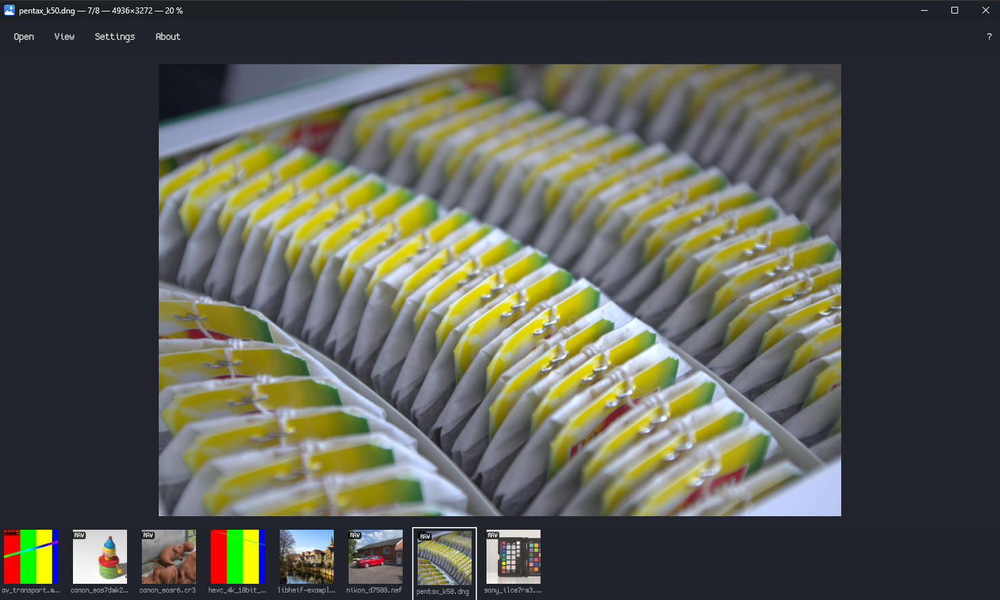

## Download

| | |
|---|---|
| **Windows 10/11, x64** | `MediaViewer-<version>-Setup.exe` from the [latest release](https://github.com/longtimeno-c/mediaviewer/releases/latest) |
| **Mac, macOS 14+, Apple Silicon and Intel** | `MediaViewer-<version>.dmg` from the [latest release](https://github.com/longtimeno-c/mediaviewer/releases/latest) |

Windows may show a SmartScreen warning the first time: the installer is not Authenticode-signed. Checksums are on each release page.

Setup's Finish page offers to delete the setup `.exe` once it closes. On a Mac, the first-launch setup sheet offers to eject the MediaViewer disk and move the `.dmg` to the Trash. Both boxes start ticked.

---

## Speed you can measure

Every number below comes from the app's own harnesses, and the raw reports are in [`docs/perf/`](docs/perf/).
Measured on a Ryzen 7 5700X3D, RTX 4070 and a 59.95 Hz display. One desktop, not a lab matrix.

| | |
|---|---|
| **0 dropped frames** | 60 s of animated panning on a 42 MP Sony RAW: 3,597 frames, p99 16.95 ms on a 16.68 ms refresh |
| **44-125 ms** | Time for a camera RAW's preview to appear; the full-resolution decode then cross-fades in without moving your view |
| **0.08 % CPU, 0 presents** | Cost of a still image sitting on screen. Idle means idle |
| **0.2 ms, then the next refresh** | Arrow to the next photo once it has been decoded ahead. The frame is ready in 0.2 ms; a 60 Hz monitor shows it within 16.7 ms |
| **51–100 ms** | Jump to a RAW that was not next to the current one: its embedded preview, about the same as opening that file |
| **0 dropped video frames** | 60 s of 1080p HEVC on screen: 3,597 presents, p99 17.10 ms. Audio/video error over that minute stays at p99 7.2 ms |

### Stills

**Panning.** Two 60 s soaks, including a 42 MP Sony RAW. The line at 16.68 ms is one refresh of this display.

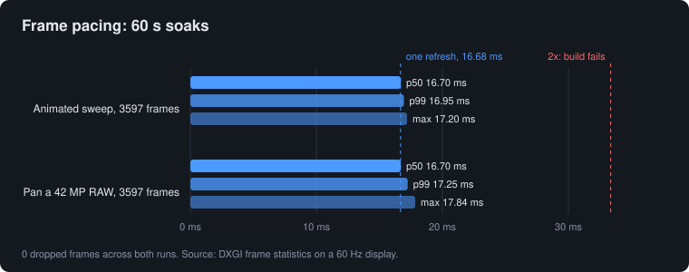

**First pixel.** Embedded preview first. The grey bar is the full decode that replaces it.

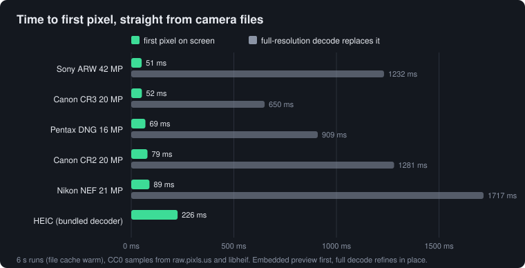

**Next photo.** Arrow after the neighbours have been decoded, and a jump to a photo that has not.

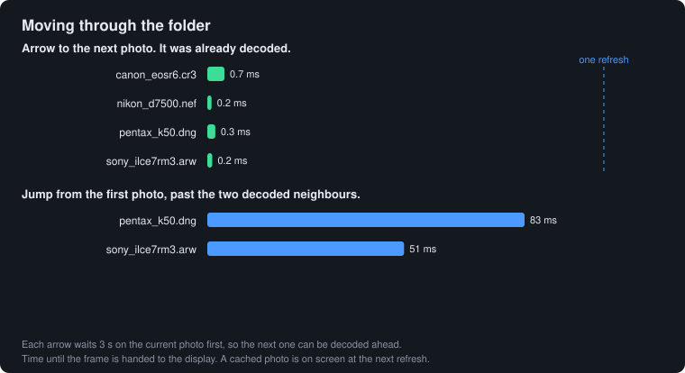

### Video

**On screen.** 60 s of 1080p HEVC. Frame time sits on the refresh. No present was dropped, and no video frame was skipped.

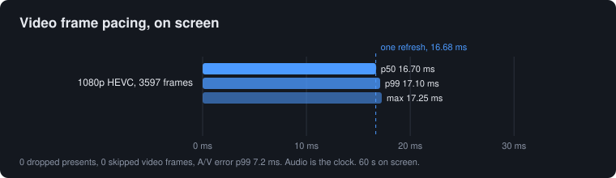

**Audio against video.** 120 s of the same kind of clip. The error stays under one frame of a 30 fps video (33.3 ms). The selector discarded 2 of 3,597 frames; that is not a dropped screen present.

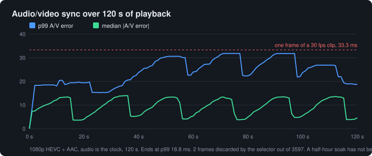

What is still slower than it should be: a full RAW decode takes 1.0–1.9 s behind the preview, and one timed Canon CR3 open dropped a frame while that preview cross-faded to the full image. A 4K HEVC test clip played at about 24 fps on screen, with a worst gap of 367 ms. Playback has been measured for one to two minutes, not yet a half hour. The folder chart is stills only.

### Against Windows Photos and Media Player

Same machine, same sample files, timed from the screen (a grab is about 17 ms). These are cold launches: the clock starts when the app is opened, so they are not the 44–125 ms in-app preview times above.

**Opening.** Two launches each. RAW is a tie. Photos is faster on the HEIC (810 ms vs 964 ms).

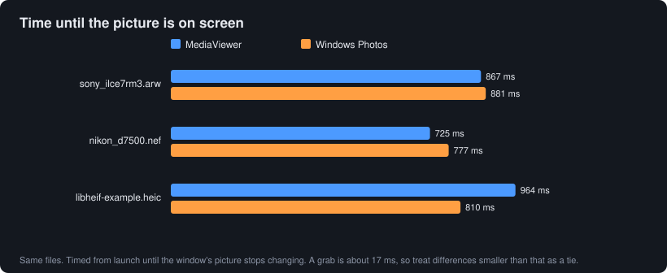

**Panning.** With the mouse, MediaViewer updates the picture about every refresh (p50 16.7 ms). The slowest updates were 49–84 ms. The same wheel-and-drag did not move the picture in Photos, so Photos has no pan number here.

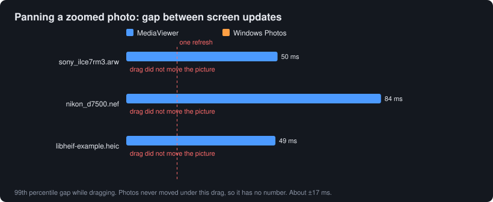

**Video.** On a 30 fps test clip both apps ran at 29 fps. Media Player's slow gaps were shorter (p99 44 ms, MediaViewer 66 ms). On a 4K HEVC clip MediaViewer averaged 24 fps; Media Player stayed on a single frame for the whole sample, so it has no playback number for that file.

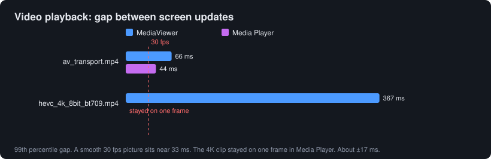

Every chart is re-measured and redrawn by one command, `python tools/perf/regenerate.py`, from the app's own harnesses; the reports it reads are in [`docs/perf/`](docs/perf/). See [the performance suite](docs/DEVELOPMENT.md#performance-suite-regenerating-the-readme-charts).

---

## Built for browsing a real dump

- **Everything in one folder.** JPEG, PNG, BMP, GIF, TIFF, WebP, HEIC, AVIF, ICO, camera RAW (CR2, CR3, NEF, ARW, DNG)
  and MP4, MOV, MKV, WebM, AVI, TS video open in the same window on the same canvas.
- **RAW+JPEG and Live Photo pairs are one entry**, one arrow-key stop, badged RAW or LIVE. Copy, move and delete act on both files.
- **Filmstrip and gallery.** A virtualised filmstrip on a persistent thumbnail cache; `G` opens a full grid.
- **Nested folders as tiles.** Child folders show with covers and counts, a path bar stays on screen, and
  `Ctrl+Up` goes up and returns to the folder you left. `Ctrl+Left` / `Ctrl+Right` hop to the neighbouring folder.
- **Folder tree** (`Ctrl+Shift+E`) and sort by name, date modified, size, type or EXIF date taken.
- **Fit, fill, 100 %, or any zoom.** Wheel zoom toward the cursor with springy, physical-feeling pan and zoom.
- **Animated GIF, APNG and WebP** play on the same frame clock.
- **Light or dark.** Follows the system appearance on Windows and macOS, and so does the canvas surround unless you pick Grey, White, Checkerboard or Dark.

| Gallery | Frame-time overlay (`F3`) |
|---|---|
| 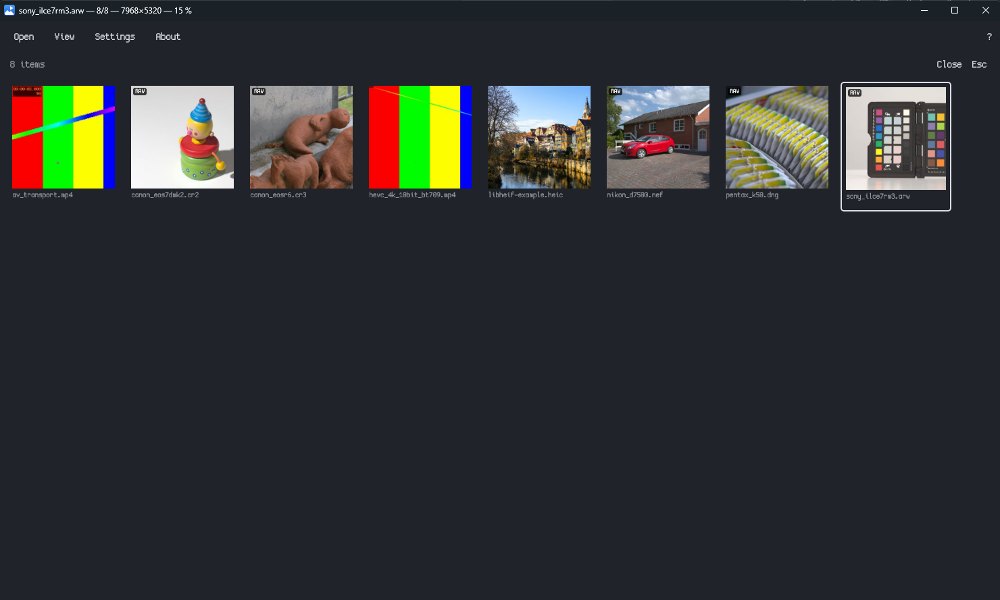 | 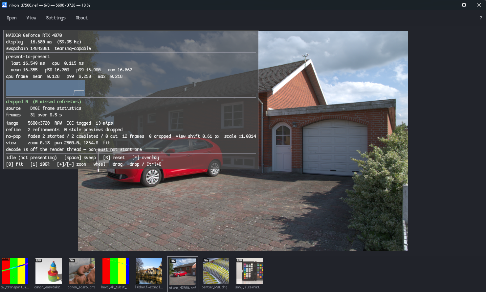 |

## Keyboard-complete

Every action has a key, and `?` shows the full list, generated from the same command table the app runs.
Arrow keys or `A`/`D` browse, `Space` advances, `Insert` marks, `F7`/`F8` copy or move marked files to a folder,
`Delete` sends to the Recycle Bin, `F11` goes fullscreen, `F5` starts a slideshow. Every key can be remapped in Settings (`Ctrl+,`).

## Video that lives with your photos

FFmpeg decode with D3D11 hardware acceleration on the same swapchain as photos. H.264, HEVC, VP9, AV1 and MPEG-2 (and Apple ProRes on the Mac),
including 10-bit HDR clips mapped to SDR. Audio is the master clock. Seek, frame step (`,` `.`), speed
0.25x-4x, A-B loop, resume where you left off, and media keys. `;` plays a Live Photo's motion and returns to the still.
The transport floats over the video and gets out of the way after a moment of playback; any movement brings it back.

## Know your shot

`I` opens a metadata pane: a summary card, a searchable tree of every EXIF, IPTC and XMP tag, and a per-stream inspector
for clips. `O` overlays camera, exposure and date on the image, `Shift+O` draws autofocus points, and `Shift+I` is a
one-pixel colour eyedropper (`Ctrl+C` copies the value).

## Colour done right

Images are converted from their embedded ICC profile through a linear working space to sRGB. A tagged image is
never assumed to be sRGB, and camera JPEGs are never tone-mapped. HDR video is mapped to SDR.

## Trustworthy by design

- **Your originals are never modified.** Browsing is read-only; edits write new files or an XMP sidecar.
- **Nothing about your files leaves the machine.** Telemetry is opt-in and off by default. Crash reports are captured
  locally, scrubbed of paths, filenames and your username, and never sent without asking.
- **No codec packs.** Decoders are bundled; you never need the Store HEVC extension.
- **Installs per user**, with a public installer and a background updater. The installer is not Authenticode-signed, so SmartScreen may warn once. It never takes over your file associations.
- **Stable or preview updates.** Updates follow stable releases by default. **Settings → Update channel → Preview**
  also installs signed preview builds as they are published; switching back to Stable keeps the installed version
  until a newer stable release arrives.
- **Hardened decoding.** A corpus of broken files and per-decoder fuzzers run in CI.

---

## Edit without touching the original

**Edit image / Edit video** in the command bar (or `Enter`) opens a docked Edit workspace beside the picture.

- **Lossless rotate and flip** for JPEGs, with no re-encode. **Crop** with aspect presets, and **straighten**.
- **Colour adjustments**: exposure, contrast and white balance. They are non-destructive, with a before/after view.
- **Every metadata tag is editable**: date taken, location, and any EXIF, IPTC or XMP tag can be changed or removed, with a byte-exact Revert.
- **Export** writes a new file with the metadata carried over. RAW, HEIC and video edits go to an XMP sidecar.

## Cut video in seconds

- **Video Editor.** *Edit video* opens the clip in its own window, with a timeline of thumbnails and a waveform. It offers Split, Delete, Set in, Set out and Undo. Export is either instant keyframe cuts or frame-accurate cuts on the GPU encoder.
- **Trim, extract and remux.** Lossless trims on keyframes or frame-accurate ones, a frame as PNG or JPEG, the audio track (copy, WAV or FLAC), a range as GIF or WebP, and MP4 ↔ MKV.
- **Every result is a new file** beside the clip.

## At home on Windows and macOS

- **Explorer thumbnails** for HEIC, AVIF and RAW, and a **Spotlight importer** and **Quick Look** on the Mac.
- **Recent folders** on the home screen, in the jump list and the Dock.
- **Taskbar and Now Playing media controls**, drag-out, copy path or edited image, the Share sheet, and single-window open.
- **The same core on both platforms:** Direct3D 11 and WinUI on Windows, Metal and SwiftUI on the Mac.

## Optional add-ons

Add-ons install from **Settings → Add-ons**. They are signed and verified, never bundled with the app, and removable at any time.

- **Import.** Copies a card or folder into your library.
  - It skips what is already there by content, and verifies every copy by reading it back.
  - It sorts into dated folders, keeping RAW+JPEG and Live Photo pairs together.
  - It resumes after an unplug and can back up to a second drive.
- **Local search.** Type what you are looking for ("guy on a skateboard", "dog barking", "happy birthday") and get the photos and the exact moments in videos. All of it is computed on your computer; nothing is uploaded.
  - **Pictures and video frames** use OpenAI CLIP: ViT-B/32 (*Fast*) or ViT-L/14 (*High*), picked for your hardware. It runs with NVIDIA acceleration on Windows and Core ML on Apple silicon. Every photo and sampled frame is indexed once in the background, so a search reads the index and never re-scans your files.
  - An optional **Sound** piece indexes what videos sound like (LAION CLAP) and what is said in them (Whisper).
  - An optional, deletable **People** piece finds faces (YuNet) and groups them (SFace). Name a person once, then search "Anna" or "videos of Anna".
  - On a Mac it can also search your **Photos library**, iCloud Photos included. It reads only what is already on the Mac and never changes the library.
  - Narrow a search as you type: `-beach` leaves something out, `video` or `is:photo` picks a kind, `in:2024` or `before:2025` limits the date, and quotes find words that are said.
  - Pieces install separately: Core about 1.2 GB, Sound about 1 GB, People about 40 MB, and at most 3 GB in all. On a Mac, Local search needs Apple silicon.
  - Export the index to one file and import it on another computer, or after moving a library to a NAS, so nothing is indexed twice. Thumbnails and People go only if you tick them.
  - `Ctrl/⌘+F` searches, `Ctrl/⌘+Shift+F` finds similar, and `N` / `Shift+N` walk the matching moments in a clip.

**How well Local search finds things.** Measured on a 25,000-photo library of captioned COCO photos, the size of a real camera roll, with the setting you get out of the box. Every result is checked against the photo's own captions. The raw report is [`docs/perf/search.json`](docs/perf/search.json).

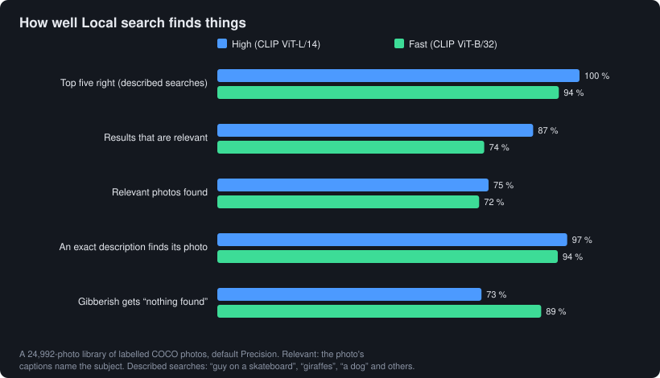

Search for something your library does not have and you mostly get "nothing found". The exception is text CLIP recognises: "qwerty" finds keyboards and "314159" finds numbers, and some placeholder text such as "lorem ipsum" still returns photos.

## Coming next

| Soon | |
|---|---|
| **Search from Final Cut Pro** (Mac) | A MediaViewer Search panel inside Final Cut Pro that uses your Local search index, so you can drag the matching moments straight into an event or the timeline. It is off until you turn it on under Local search ([plan/23](plan/23-nle-search.md)) |
| **Voice search** (optional add-on) | Speak the query to Local search. Speech runs on-device ([plan/19](plan/19-voice.md)) |
| **Video Editor, several clips** | Several clips on one timeline, zoom and dissolves ([plan/21](plan/21-video-editor.md)) |
| **Editor add-on** (optional) | Colour grading, multi-track editing, titles and captions, an audio mixer and delivery presets ([plan/22](plan/22-editor-addon.md)) |
| **Explorer details** | Explorer's Details-pane properties and tab-grouped windows |

## From source

Building needs Visual Studio 2022, CMake 3.28+, vcpkg and the .NET 8 SDK. The first configure builds FFmpeg and takes a while. Commands, tests and the macOS recipe are in [docs/DEVELOPMENT.md](docs/DEVELOPMENT.md).

```powershell
git clone https://github.com/longtimeno-c/mediaviewer
cd mediaviewer
cmake -S . -B build -G "Visual Studio 17 2022" -A x64
cmake --build build --config Release
.\build\bin\Release\mediaviewer_lab.exe C:\path\to\photos
```

Reproduce every chart above with `python tools/perf/regenerate.py` (about 15 minutes on a quiet machine; `--list` shows what it needs).

## Licence

GPL-3.0-or-later, see [LICENSE](LICENSE) and [NOTICE](NOTICE); the reasoning is in [plan/11-licensing.md](plan/11-licensing.md).
Copyright (C) 2026 longtimeno-c. Copies and forks must keep the copyright notices, `LICENSE`, `NOTICE` and the
in-app legal notices; they may charge for it, as the GPL allows. Please do not present a fork as the original MediaViewer.
Bundled libraries and their licences are listed in [THIRD-PARTY.md](THIRD-PARTY.md).
Screenshots use CC0 sample files from [raw.pixls.us](https://raw.pixls.us) and libheif.
